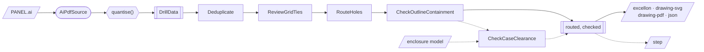
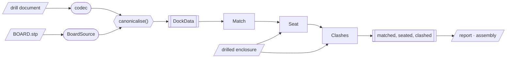

# Architecture overview

Both tools read geometry, convert measurements to exact lengths, process the
result, and write output files. Each output uses the same processed data, so a
drill program and drawing agree on hole positions and diameters.

The [ADRs](adr/) record the design decisions. The [foundation document](FOUNDATION.md)
describes the formal model and the properties checked by tests.

## Packages

| Package | Responsibility |
| --- | --- |
| `stompmodel` | Shared lengths, coordinate frames, drill data, diagnostics, JSON codec and processing protocols |
| `stompgeom` | OpenCASCADE operations: reading, writing, building, intersecting and measuring solids |
| `stompdrill` | Illustrator artwork to drill files, drawings and a drilled enclosure model |
| `stompcollider` | Board placement and clash reporting inside a drilled enclosure |

Each package installs and passes its own tests independently. `stompcollider`
uses `stompmodel` and `stompgeom`; it does not depend on `stompdrill` or import
OCP directly. Package-boundary tests check these dependencies.

`stompmodel` is pure Python. `stompgeom` requires `cadquery-ocp`, so both tools
include the geometry kernel when installed.

## Drill processing

The reader produces `RawDrillData`, with measured float lengths in millimetres.
`quantise()` identifies the enclosure, selects drill diameters and snaps hole
positions, in that order. It returns `DrillData` with integer-nanometre lengths.
An enclosure error stops quantisation. A rejected diameter records an error and
omits that hole from the result.

The pipeline removes duplicates, reviews grid ties, assigns the drilling order
and checks that holes fit within the outline. With `--case-model`, it also checks
clearance against the enclosure. The dashed paths in the diagram require that
option; STEP output cuts the supplied model.

`cli.build_pipeline` specifies the stage order. Each stage implements the
`Stage` protocol and works independently; a stage does not assert that a
previous stage has run. `Pipeline` applies the stages in the supplied order.

## Board placement

The drill document identifies the holes, enclosure and drilled face.
`BoardSource` reads the board geometry. `canonicalise()` converts the measured
lengths to integer nanometres, producing `DockData`.

`Match` pairs protruding elements with holes. `Seat` searches for placements by
inserting boards through the open back until they contact the enclosure.
`Clashes` measures interference and ranks the resulting placements. Report and
assembly emitters read the finished data.

The tools exchange ordinary JSON and STEP files. This allows `stompcollider` to
read the drill document through `stompmodel` without importing `stompdrill`.

## Shared data and output

Measurements cross one boundary from float millimetres to integer nanometres.
The `Millimetre`, `Nanometre` and `Micron` types make the unit visible to type
checking. Canonical coordinates use a Y-up frame centred on the reference
outline. Model operations handle coordinate transforms; emitters convert to the
frames and units required by their formats.

`DrillData` carries geometry, diagnostics, processing history, tool assignments
and drilling order. Its versioned JSON codec is shared by both tools. Version 6
uses `CaseRegistration` for the enclosure part, drilled face, model filename and
face frame. The snapping-stage name and grid-pitch key are shared constants;
`DrillData.grid_nm` reads them, and `stompcollider` uses that pitch to derive its
default matching tolerance.

The emitters format the completed data without recalculating domain decisions.
They return text or bytes. Both CLIs use `stompmodel.protocols` to validate targets,
stage all requested outputs and commit them, with rollback on a later failure.
The [CLI reference](CLI.md#output-files-and-failures) describes what users can
expect; [ADR-0001](adr/0001-pipeline-and-emitter-adapters.md) gives the full
transaction guarantee and exclusions.

Ordering is based on geometry, independent of input element order. The rules
and the limits of byte determinism, including source provenance and STEP
headers, are recorded in [ADR-0006](adr/0006-toolpath-ordering-and-hole-numbering.md)
and [ADR-0007](adr/0007-case-model-and-clearance.md).

## Geometry services

`stompgeom` provides shared operations through a small set of modules:

- `shapes.common` returns an intersection for measurement. `interferes` is a
  non-destructive, fuzzy predicate used to test pairs at many poses.
  `volume_mm3` and `centre_of_mass_mm` provide measurements.
- `step` reads STEP files and label names, distinguishing unnamed labels from
  OpenCASCADE's generated placeholders.
- `writer.render_step` serialises a finished STEP payload.
- `levels()` groups planar faces by their planes.
- `build.build_document` assembles placed, named and coloured solids.

Shared length validation and diagnostic helpers live in `stompmodel`:
`check_millimetres`, `check_nanometres`, `Diagnosable`, `of_severity`,
`worst_severity` and `latest_run`.

## Drawing output

The SVG and PDF emitters share `emitters/drawing/`. `content` collects the facts
shown on a sheet, `layout` calculates sheet geometry, and `build` produces a
`Scene`. Each backend exposes `render(scene, title)` to serialise that scene.

SVG fixes the sheet and fits the drawing scale. PDF fixes the scale at 1:1 and
chooses a sheet from the ISO 5457 sizes. The two drawings may show different
numbers of rows, but shared rows must agree. Tests parse both formats to check
this. An explicit library `DrawingOptions(scale=…)` that overflows the sheet
produces a `CONTENT EXCEEDS` marker; the CLI has no scale option.
