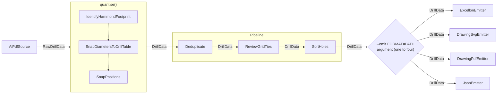

# ADR-0001: Processing architecture and artifact consistency

**Status:** Accepted

## Context

`aidrill` reads measured drill geometry and can emit several representations of the
same panel. Every artifact from one invocation must describe the same accepted holes,
tool set, ordering, diagnostics, and processing provenance. Computing any of those
facts independently in an emitter would create multiple authorities for one panel.

The architecture therefore needs an explicit boundary between measured source data,
canonical drill data, processing that changes shared facts, and presentation that only
changes how those facts are represented.

## Decision

`AiPdfSource` produces unquantised `RawDrillData`. The `quantise()` processing phase
turns that measured input into canonical `DrillData`. A `Pipeline` then groups
`Deduplicate`, `ReviewGridTies`, and `SortHoles` as independent stages, each accepting
and returning `DrillData`.

All facts shared by more than one artifact are computed once before emission and travel
on `DrillData`. This includes diagnostics and processing provenance. Emitters serialise
the resulting document and may perform presentation-only transformations such as unit,
coordinate-frame, or textual formatting. They do not quantise, deduplicate, classify,
sort, or otherwise re-derive shared facts.

An invocation selects one to four emitters through repeatable
`--emit FORMAT=PATH` arguments. Emitter payloads may be text or bytes; see ADR-0005.
The processing blocks, aggregate boundaries, and typed transfers are shown in ADR-0001,
Figure 1.

Emitter registration is extensible: a format maps to an emitter without changing the
processing contract. The CLI explicitly composes the ordered post-quantisation stages;
each stage remains independent, and `Pipeline` applies them in the supplied order.

Figure 1 — Processing blocks, aggregate boundaries, and transferred document types.

## Rationale

The typed transition from `RawDrillData` to `DrillData` makes the processing boundary
visible. Keeping shared calculations before the emitter fan-out gives every artifact
one authority and makes disagreement structurally difficult. Keeping the three pipeline
stages independent preserves their single responsibilities while allowing their fixed
composition to be read at the invocation boundary.

Diagnostics and provenance belong to the canonical document because they describe the
same decisions as the accepted geometry. Carrying them with that geometry lets console,
drawing, and machine-readable output present the same findings without recomputation.

## Consequences

Every emitter receives the same fully processed `DrillData`, so artifact differences are
limited to their intended presentation. A new emitter consumes the existing canonical
contract and cannot require a parallel processing path.

Processing changes must occur before emission and update the canonical document. The
extra separation between quantisation, independent pipeline stages, and emitters is a
deliberate cost: callers and maintainers must preserve the typed flow and must not move
domain decisions into format-specific code.
