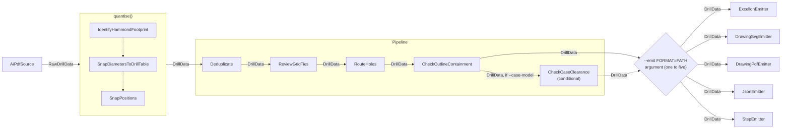

# ADR-0001: Processing architecture and artifact consistency

**Status:** Accepted, amended by
[ADR-0009](0009-shared-model-package-and-dependency-order.md), which moves
`Stage`, `Pipeline` and `Emitter` into `stompmodel` and makes them generic in
the value they fold over. The reasoning here for one authority per fact and for
computing shared facts once is unchanged.

## Context

`stompdrill` reads measured drill geometry and can emit several representations of the
same panel. Every artifact from one invocation must describe the same accepted holes,
tool set, ordering, diagnostics, and processing provenance. Computing any of those
facts independently in an emitter would create multiple authorities for one panel.

The architecture therefore needs an explicit boundary between measured source data,
canonical drill data, processing that changes shared facts, and presentation that only
changes how those facts are represented.

## Decision

`AiPdfSource` produces unquantised `RawDrillData`. The `quantise()` processing phase
turns that measured input into canonical `DrillData`. A `Pipeline` then groups
`Deduplicate`, `ReviewGridTies`, `RouteHoles` and `CheckOutlineContainment` as
independent stages, each accepting and returning `DrillData`.

All facts shared by more than one artifact are computed once before emission and travel
on `DrillData`. This includes diagnostics and processing provenance. Emitters serialise
the resulting document and may perform presentation-only transformations such as unit,
coordinate-frame, or textual formatting. They do not quantise, deduplicate, classify,
sort, or otherwise re-derive shared facts.

An invocation selects one to five emitters through repeatable
`--emit FORMAT=PATH` arguments. Emitter payloads may be text or bytes; see ADR-0005.
The processing blocks, aggregate boundaries, and typed transfers are shown in ADR-0001,
Figure 1.

One invocation's artefacts are one transaction: the command line writes every
requested artefact or none of them. An ERROR diagnostic withholds all of them before
rendering begins, as already stated above. Past that gate, every payload is rendered
before any target path is touched; the command line then stages every rendered payload
to a temporary beside its own target, and only once every one of those writes has
succeeded does it replace each target from its temporary. A failure anywhere in
rendering or staging — an emitter's own fault, or the operating system refusing a
write, at any target and at any position in the requested set — unwinds whatever this
invocation had staged and leaves every target exactly as it was before the run,
whether that is absent or holding a previous invocation's artefact. ADR-0005 gives
`stage_payload`/`commit_staged` the matching guarantee for one path in isolation; this is
the set-level rule built on top of it, and it stays the command line's own for as long as
`stompdrill` is the only caller composing a set of several artefact paths for one
invocation.

Emitter registration is extensible: a format maps to an emitter without changing the
processing contract. The CLI explicitly composes the ordered post-quantisation stages;
each stage remains independent, and `Pipeline` applies them in the supplied order.

Figure 1 — Processing blocks, aggregate boundaries, and transferred document types.

## Rationale

The typed transition from `RawDrillData` to `DrillData` makes the processing boundary
visible. Keeping shared calculations before the emitter fan-out gives every artifact
one authority and makes disagreement structurally difficult. Keeping the pipeline
stages independent preserves their single responsibilities while allowing their fixed
composition to be read at the invocation boundary.

Diagnostics and provenance belong to the canonical document because they describe the
same decisions as the accepted geometry. Carrying them with that geometry lets console,
drawing, and machine-readable output present the same findings without recomputation.

## Consequences

Every emitter receives the same fully processed `DrillData`, so artifact differences are
limited to their intended presentation. A new emitter consumes the existing canonical
contract and cannot require a parallel processing path.

Processing changes must occur before emission and update the canonical document. The
extra separation between quantisation, independent pipeline stages, and emitters is a
deliberate cost: callers and maintainers must preserve the typed flow and must not move
domain decisions into format-specific code.

Staging every artefact before committing any of them costs one extra temporary file per
target, briefly present beside it until the whole set commits. That is the deliberate
price of never leaving a previous invocation's artefact replaced by only part of this
one's. The set-level rule is composed from `stompmodel`'s per-path mechanism rather than
restating it: the command line calls `stage_payload` for every requested target, then
`commit_staged` for each in turn, and `discard_staged` for whatever it abandons.
`stompdrill` states no temporary-file mechanism of its own. What order the set is
committed in, and what happens to the rest when one commit fails, remain the command
line's own and are stated nowhere below it.

The opening claim above — that one invocation's artefacts are one transaction, full
stop — remains false of the code as shipped: a commit failure partway through a set
leaves every target already replaced holding this run's bytes, as the commit loop's own
docstring concedes. This move does not close that gap; ticket 29 owns it.
