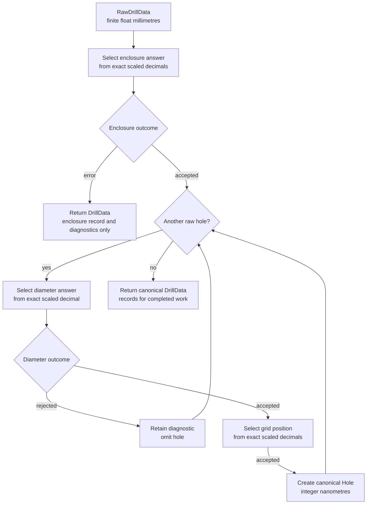

# ADR-0003: Quantisation boundary and ordering

**Status:** Accepted

## Context

Sources report measurements as finite `float` millimetres. The canonical model stores
lengths as integer nanometres. Crossing between those representations is a domain
decision, because the source value must first be compared with an enclosure footprint,
drill size, or grid position.

Rounding a measurement to a whole nanometre before that comparison can place it on a
midpoint it did not occupy. A later tie-break can then choose a different answer even
though the preliminary rounding was much smaller than the answer-set spacing. The phase
also has asymmetric failures: an enclosure error invalidates the panel, whereas an
unmatched diameter invalidates one hole.

## Decision

Source measurements remain finite `float` millimetres in `RawDrillData`. For answer-set
selection, each measurement is scaled through its exact decimal spelling and compared as
a decimal nanometre value. It is not rounded to a whole nanometre first. Preliminary
nanometre rounding is forbidden because it can manufacture a midpoint tie.

After selection, every canonical model length is an integer number of nanometres. The
quantisation phase runs enclosure identification first, diameter selection second, and
position selection last. An enclosure error terminates the phase before any hole work.
A rejected diameter retains its diagnostic and omits only that hole; accepted diameters
continue to position selection. Processing records describe only work that actually ran.
ADR-0003, Figure 1 shows these control and termination points.

Figure 1 — Quantisation control flow and termination points.

Representation rounding and grid tie-breaking are separate rules. Representation
rounding answers which integer nanometre represents a measured or displayed value and
uses decimal half-up rounding, with midpoint ties away from zero. Grid tie-breaking
answers which of two valid grid positions receives a hole exactly between them and uses
half-to-even selection to avoid directional bias. Neither rule may be substituted for
the other.

Every numeric rule must establish an observable invariant in the model or an emitted
artefact. Internal arithmetic alone is not an architectural guarantee. At this boundary,
the principal invariant is that every canonical length is an integer nanometre and every
selected value belongs to its governing answer set; artefact representations must be
derived from those canonical values.

Later processing carries forward the selected answer without re-deriving it from the
measurement. If a later stage must review the same question, it must use the same rule
and the preserved measurement. It must not use a difference calculated from an already
rounded canonical value: that difference can manufacture a tie that the original
measurement did not contain. Sharing the rule also prevents two implementations from
answering the same question differently.

## Rationale

Exact decimal scaling preserves the measurement's ordering relative to neighbouring
answers until the domain has selected one. Converting the selected answer to the
canonical integer representation then creates a stable value that all later processing
and emission can share.

The phase order minimises invalid work and accurately records what happened. Enclosure
failure makes every hole irrelevant, while diameter rejection makes position work for
that hole unnecessary. Retaining diagnostics while omitting rejected holes preserves the
reason for each exclusion without presenting the excluded geometry as drillable.

Separate rounding policies are necessary because representation and placement have
different semantics. Making their results observable ensures that model consumers and
artefacts can verify the rule at the boundary where it matters.

## Consequences

No processing after `quantise()` accepts measured millimetre floats as canonical lengths.
Callers and emitters consume integer nanometres and must not introduce a second
measurement-to-model boundary.

Quantisers compare exact scaled decimal measurements directly with their answer sets.
Changes to rounding, midpoint handling, phase order, or early termination are
architectural changes to this decision, even when their numerical effect is less than a
nanometre.

A terminated enclosure run contains no claim that diameter or position work occurred. A
completed enclosure run records the diameter and position work, retains diagnostics for
rejected diameters, and exposes only accepted holes to the later pipeline and emitters.
