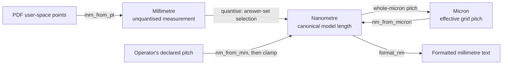

# ADR-0004: Branded length units

**Status:** Accepted, amended by
[ADR-0009](0009-shared-model-package-and-dependency-order.md), which moves
`Nanometre` and `Millimetre` into `stompmodel` and leaves `Micron` in
`stompdrill`. The reasoning here for branding at a real conversion, and for
losing the brand under arithmetic, is unchanged.

## Context

Three different lengths travel through the tool and all three are ordinary Python
numbers. A source reports an unquantised measurement in millimetres as a `float`. The
canonical model holds a nominal length in whole nanometres as an `int`. The grid pitch is
declared in whole microns, also an `int`.

Nothing in those representations distinguishes them. A nanometre count and a micron count
are both `int`, so a value in one unit can be passed, stored, or compared where the other
is expected and the arithmetic will succeed with a result wrong by a factor of a thousand.
That error can produce a well-formed artefact describing the wrong panel, which is
costly when the output is used to drill aluminium.

This decision addresses scaled values stored in the wrong unit: a length is multiplied
or divided by a conversion factor, then assigned where the original unit is expected.
The conversions themselves are few and deliberate. The risk arises when their results
cross a boundary, rather than from mixing units within one expression.

## Decision

Each unit is a distinct `typing.NewType` over its representation. Two of the three
are shared and live in `stompmodel.units`; the third is `stompdrill`'s alone, because
the grid pitch is a statement about that tool's policy rather than about length:

```python
# stompmodel.units
Nanometre  = NewType("Nanometre", int)    # every canonical model length
Millimetre = NewType("Millimetre", float) # an unquantised measurement

# stompdrill.units
Micron     = NewType("Micron", int)       # the effective grid pitch
```

A brand is applied only where a value becomes that unit: at a source's
measurement, at a conversion in either `units` module, at a quantiser's selected
answer, and at a re-wrap after arithmetic. Conversions run one way, from measurement
toward the canonical unit, as ADR-0004, Figure 1 shows.



Figure 1 — Unit boundaries and conversion directions.

`stompmodel.units` owns `nm_from_mm` and `format_nm`. `mm_from_pt` and
`nm_from_micron` remain in `stompdrill.units`: only the PDF source measures in
points, and `Micron` describes that tool's effective grid pitch.

Arithmetic on a branded value yields the underlying unbranded type. A scaled result must
therefore be re-wrapped explicitly before it can be stored as a length again, and that
re-wrap is the boundary this decision exists to make visible.

`Micron` types the effective pitch after clamping and validation. The argument arrives
in nanometres so that a request finer than a micron can be represented, clamped and
reported with a warning. Accepting a `Micron` argument would remove that outcome.
The canonical nanometre pitch is then derived from the validated `Micron`. This
construction ensures a whole-micron pitch and keeps the two representations consistent.

`Millimetre` converts only toward `Nanometre`. Presentation arithmetic inside an emitter —
scale factors, sheet coordinates, arrowhead geometry — is not a length the model holds and
stays an unbranded `float`.

Type checking covers the test suite as well as the package, because most hand-built lengths
live in fixtures. Test helpers that construct model values accept plain literals and brand
them internally, so a fixture states the number it means at the one place that knows the
unit.

## Rationale

Losing the brand under arithmetic makes unit conversions visible. A wrapper class with
typed operators would keep its type through multiplication, allowing a rescaled value
to be stored in the original unit without a type error. Refusing scalar multiplication
would also be unsuitable: quantisers need it to derive warning thresholds from pitches,
generate size tables from steps, and halve outlines for frame translations.

Applying the brand only at real conversions keeps the annotation honest. A brand attached
everywhere would be noise; a brand attached where a unit is established marks the places a
reader must check.

Extending the check to fixtures is where the unit is most easily misstated, because a test
writes lengths as literals with no conversion to reason about.

## Consequences

A new length is annotated with the unit it is in. A value derived by arithmetic is
re-wrapped where it becomes a length, and that re-wrap is a deliberate statement that the
result is in the named unit.

The brands identify boundaries but cannot prove a unit is correct. Explicitly wrapping
a value in the wrong unit still type-checks. The benefit is that every conversion is
visible for review.

Runtime validation remains. The model still rejects a length that is not a plain integer,
and `SnapPositions` still validates that its effective pitch is a whole number of microns;
a brand describes intent and does not check a value that arrives from outside the type
checker's reach.

### Amendment: shared runtime guards

`stompmodel.units` exports `check_millimetres` and `check_nanometres`. Each accepts only
its plain representation: a finite `float` or a plain `int`, respectively. A failure
names the owner and member.

Several `stompdrill` quantisers and stages previously copied the nanometre check. Making
it public, like the millimetre check, gives those callers one supported rule. Leaving
it private would allow changes to break them without `__all__`, ruff or mypy detecting
the dependency.

### Amendment: coordinate-frame validation

Every canonical length in an emitted document must pass the guard, including the
`Nanometre` triple `CoordinateFrame.origin_nm`. Construction checks its components
with `check_nanometres`; a `Nanometre(...)` cast alone cannot validate them because
`NewType` returns its argument unchanged at runtime.

Before this amendment, the case block restored its origin using only that cast. A float
origin, two-component basis, all-zero basis and left-handed basis could all be restored
without validation. Construction now also requires an orthonormal, right-handed basis
within a measured tolerance. This rejects malformed or mirrored frames before an
emitter maps hole positions through them.
