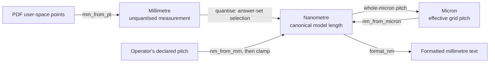

# ADR-0004: Branded length units

**Status:** Accepted

## Context

Three different lengths travel through the tool and all three are ordinary Python
numbers. A source reports an unquantised measurement in millimetres as a `float`. The
canonical model holds a nominal length in whole nanometres as an `int`. The grid pitch is
declared in whole microns, also an `int`.

Nothing in those representations distinguishes them. A nanometre count and a micron count
are both `int`, so a value in one unit can be passed, stored, or compared where the other
is expected and the arithmetic will succeed with a result wrong by a factor of a thousand.
The output is drilled into aluminium, so a length that is silently off by a scale factor is
the expensive class of defect: it produces a well-formed artifact describing the wrong
panel.

The hazard is specifically a **unit-scaled value crossing a boundary** — a length that has
been multiplied or divided by a scale factor and then stored back where the unscaled value
belongs. Mixing units inside a single expression is not how this arises; the conversions
are deliberate and few, and the danger is that their result lands in the wrong slot.

## Decision

Each unit is a distinct `typing.NewType` over its representation:

```python
Nanometre  = NewType("Nanometre", int)    # every canonical model length
Micron     = NewType("Micron", int)       # the effective grid pitch
Millimetre = NewType("Millimetre", float) # an unquantised measurement
```

A brand is applied only where a value genuinely becomes that unit: at a source's
measurement, at a conversion in `stompmodel.units`, at a quantiser's selected answer, and at a
re-wrap after arithmetic. Conversions run one way, from measurement toward the canonical
unit, as ADR-0004, Figure 1 shows.



Figure 1 — Unit boundaries and the direction each conversion runs.

Arithmetic on a branded value yields the underlying unbranded type. A scaled result must
therefore be re-wrapped explicitly before it can be stored as a length again, and that
re-wrap is the boundary this decision exists to make visible.

`Micron` types the pitch **after** it has been clamped and validated, not at the argument
where it arrives. The pitch is accepted in nanometres so that a request finer than a micron
remains expressible and can be clamped with its own warning; a `Micron` argument would make
that outcome unrepresentable and remove a diagnostic the operator depends on. The canonical
nanometre pitch is then derived from the `Micron`, so wholeness is a property of how the
pitch is built rather than a check whose result is discarded, and the two spellings of one
pitch cannot disagree.

`Millimetre` converts only toward `Nanometre`. Presentation arithmetic inside an emitter —
scale factors, sheet coordinates, arrowhead geometry — is not a length the model holds and
stays an unbranded `float`.

Type checking covers the test suite as well as the package, because most hand-built lengths
live in fixtures. Test helpers that construct model values accept plain literals and brand
them internally, so a fixture states the number it means at the one place that knows the
unit.

## Rationale

Losing the brand under arithmetic is the property that makes this work rather than a
weakness to be engineered away. A wrapper class with typed operators would preserve its own
type through multiplication, so re-scaling a length and storing it back would type-check
cleanly — which is precisely the boundary crossing that must not pass. Refusing scalar
multiplication instead would reject the legitimate arithmetic the quantisers depend on:
deriving a warning threshold from a pitch, generating a size table from a step, halving an
outline to translate a frame.

Applying the brand only at real conversions keeps the annotation honest. A brand attached
everywhere would be noise; a brand attached where a unit is established marks the places a
reader must check.

Extending the check to fixtures is where the unit is most easily misstated, because a test
writes lengths as literals with no conversion to reason about.

## Consequences

A new length is annotated with the unit it is in. A value derived by arithmetic is
re-wrapped where it becomes a length, and that re-wrap is a deliberate statement that the
result is in the named unit.

The brands are a boundary marker, not a proof. An explicit wrap launders any value, so a
re-wrap that names the wrong unit type-checks. What the types provide is that every such
place is written down and can be reviewed, rather than being indistinguishable from
ordinary arithmetic.

Runtime validation remains. The model still rejects a length that is not a plain integer,
and `SnapPositions` still validates that its effective pitch is a whole number of microns;
a brand describes intent and does not check a value that arrives from outside the type
checker's reach.
