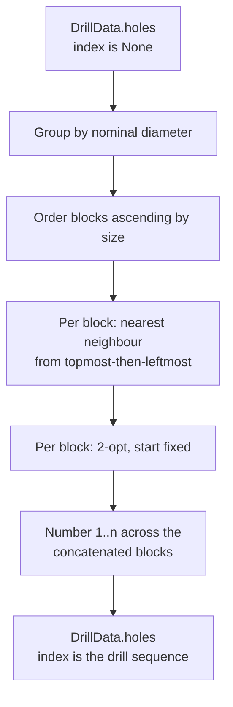

# ADR-0006: Toolpath ordering and hole numbering

**Status:** Accepted

## Context

`Hole.index` was the position of a circle in Illustrator's content stream, and every
artifact printed it: drawing balloons, the schedule, the command-line report, and the
prose of four diagnostics. `SortHoles` ordered holes by `(-y_nm, x_nm)` for emission but
did not renumber them, so the number a machinist read bore no relation to the order they
drilled in.

Three consequences followed. Artwork order reached the artifacts: `(-y, x)` is not a
total order, so two holes at one point with different diameters tied and a stable sort
fell back to stream position — two files with identical geometry produced different
output. The drill file and the drawing disagreed about sequence, one being tool-major and
the other reading order, against the requirement that every artifact from one invocation
agree. And no artifact expressed a toolpath at all.

## Decision

**Geometry alone determines output.** If two input artifacts represent the same geometry,
this program's artifacts are byte-identical, whatever the inputs' internal structure or
element order.

`SortHoles` becomes `RouteHoles` in `pipeline/route.py`, recording itself as `"route"`.
It plans the drilling sequence and is the only place holes are ordered or numbered:

- Holes group by nominal diameter, blocks ascending by size, matching the `T1…Tn` that
  `DrillData.tools()` already assigns. Each tool is installed once and removed once.
- Each block routes independently of every other. The move between blocks happens while
  the bit is being changed, so it is not optimised.
- Within a block: nearest-neighbour with visited tracking from the block's
  topmost-then-leftmost hole, then 2-opt improvement with the start hole fixed, sweeping
  `i < j` and taking the first improving reversal.
- Ties break on `(-y_nm, x_nm)` and then on the measurement the hole was quantised from.
  Nominal position alone is not a total order: two holes can share one nominal point,
  and `min` would otherwise keep whichever the caller listed first. `Deduplicate`
  collapses such a pair, but stages are independent and a caller may omit it. Two holes
  equal in both nominal and measured values are interchangeable, so no output can
  distinguish them.

Every rule is geometric; none consults input order. ADR-0006, Figure 1 shows the phases.

`Hole.index` is the drill sequence: `1…n`, contiguous, typed `int | None` and defaulting
to `None`. `RouteHoles` introduces the number and never rewrites one, because no earlier
stage sets it. `RawHole.index` is removed; diagnostics identify holes by coordinate
instead of by number, which is what frees the number to be assigned late.

`DrillData.numbered()` pairs each hole with its number and is the only place a number is
read. An emitter given unrouted data raises `EmitterError` naming the remedy.

## Rationale

Numbering at the source and adding an offset per renderer were both rejected: the
program's own tool table starts at `T1`, so a hole index starting elsewhere is the model
disagreeing with itself, and an offset applied in five renderers is five chances to
disagree.

A provisional traversal-order number assigned by `quantise()` was rejected because it is
input-derived. A pipeline composed without `RouteHoles` would then emit artwork order and
silently forfeit the invariant — an exception to the rule inside the decision that
establishes it. With no provisional value there is nothing to leak, and refusing to emit
is louder than emitting the wrong sequence onto a sheet that reaches a shop floor.

Exact TSP is not attempted. Nearest-neighbour alone was measured leaving an avoidable
81 mm crossing on `tests/fixtures/pax.ai`; adding 2-opt reached that block's brute-force
optimum of 144.6 mm. The heuristic is retained rather than exact search because block
sizes are unbounded, and no artifact claims the path is shortest.

Each block's start is fixed geometrically rather than chosen to minimise the path. That
costs 3.2 mm of 141.4 mm on the same block, and buys a start a machinist can anticipate
and a rule that does not need a tie-break where two candidate starts are equidistant by
construction — which every mirror-symmetric block guarantees.

## Consequences

Hole numbers ascend along the drilling path, not across the page. A panel whose holes
read `5, 4, 7, 3, 6, 2` left-to-right is numbered correctly; following `1…n` traces the
route.

Ordering is no longer expressible as a sort key. `RouteHoles(key=…)` is retained for a
library caller who wants a plain ordering, and then performs no grouping and no routing;
`describe()` records which ran. A caller passing a key can break tool contiguity.

The `processing` record names the stage `"route"`, so a consumer matching `"sort"` breaks.
`Hole.index` in the JSON changes meaning from artwork identity to drill sequence, and
`hole_index` leaves every diagnostic payload.

Emitters accept less than before: unrouted data is an error rather than a drawing whose
balloons carry artwork order. `Source` implementations construct `RawHole` without an
index.

Changes to the block order, the routing rule, the tie-break, or the point at which numbers
are assigned are architectural changes to this decision.
