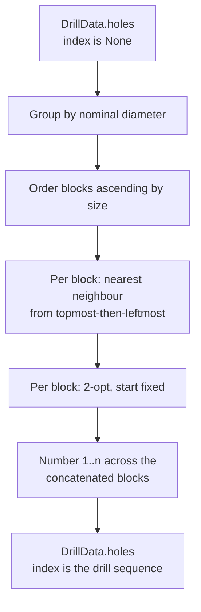

# ADR-0006: Toolpath ordering and hole numbering

**Status:** Accepted, with five amendments in place:

1. Remove the `RouteHoles(key=…)` argument.
2. Require every pipeline selection rule to be total on geometry.
3. Publish the raw-measurement tie-break once, enforce its ownership with a structural
   test, and record when the reader's selection rule should become shared.
4. Require formats that express sequence by element position to sort by the numbers
   returned through `DrillData.numbered()`.
5. Establish `1…n` in `RouteHoles` and enforce it in `stompmodel.codec.from_document`,
   without auditing the set in `Hole`, `DrillData` or `DrillData.numbered()`.

The decisions and their history are recorded below.

## Context

`Hole.index` originally recorded a circle's position in Illustrator's content stream.
Drawing balloons, the schedule, the command-line report and four diagnostic messages
printed it. `SortHoles` ordered holes by `(-y_nm, x_nm)` for emission without renumbering
them, so the printed number did not describe the drilling sequence.

This caused three problems:

- Artwork order affected output. Two holes at the same position with different diameters
  tied on `(-y, x)`, leaving a stable sort to choose by stream position. Identical geometry
  could produce different artefacts.
- The drill file used tool order while the drawing used reading order, so the outputs
  disagreed about sequence.
- No artefact expressed a planned toolpath.

## Decision

### Selection depends on geometry

Two input artefacts representing the same geometry must produce byte-identical outputs,
regardless of their internal structure or element order.

The second amendment extends this requirement to every selection rule. Choosing a
reference outline, a survivor from coincident holes or a routing tie-break must use a
total order on the candidates' geometry. Swapping candidates in the input must not change
the winner. If the first comparison ties, compare further geometric bounds in a stated
order until a winner is determined or the candidates are geometrically interchangeable.
Either interchangeable candidate may survive.

This applies to `_largest_non_circular` in `sources/ai_pdf.py`, which compares candidate
bounds; `Deduplicate` in `pipeline/dedupe.py`; `RouteHoles` in `pipeline/route.py`; and
the within-row grouping in `stompmodel.model.DrillData.rows()`.

### Shared raw-measurement tie-break

The third amendment makes `Hole.tie_break`, a property on `stompmodel.model.Hole`,
the only implementation of the raw-measurement order: raw `x`, then raw `y`, then raw
`diameter`.

The read-only property breaks ties after a caller's primary comparison. `RouteHoles`
uses it after its reading-order prefix; `Deduplicate` uses it directly because a
coincident group already shares nominal position and diameter; `rows()` uses it after
nominal `x`. The routing prefix `-y_nm, x_nm` remains routing policy and can change
only through this ADR.

`packages/stompmodel/tests/test_tie_break_owner.py` rejects tuples constructed from a
hole's raw `x`, `y` and `diameter` outside `stompmodel.model`. The gate belongs to the
rule's owner under ADR-0008. It reads installed packages' source as text using
`tools.workspace_membership.member_package_dirs`, without importing packages above
`stompmodel` in the dependency order. A new package joins the scan as soon as its `src`
directory exists. The gate names no particular stage; adding a fourth raw-measurement
field to the property updates all its consumers together.

The reader's `_largest_non_circular` has the same obligation to select by a total order,
but works on path bounds owned by `stompdrill`. It currently has one implementation and
one caller, so it remains in the reader. When a second caller needs this selection rule,
it must be published beside the type it selects over. No shared API is needed before
that second use exists.

### Routing algorithm

`RouteHoles` replaces `SortHoles` in `pipeline/route.py` and records itself as `"route"`.
It plans the drilling sequence and is the only stage that orders and numbers holes:

- Group holes by nominal diameter and order blocks by ascending size, matching the
  `T1…Tn` assigned by `DrillData.tools()`. Each tool is installed and removed once.
- Route each block independently. The move between blocks occurs during a bit change
  and is not optimised.
- Start each block at its topmost, then leftmost hole. Use nearest-neighbour routing
  with visited tracking, followed by 2-opt improvement with the start fixed. Sweep
  `i < j` and take the first improving reversal.
- Break ties by `(-y_nm, x_nm)`, then `Hole.tie_break`. Nominal position alone cannot
  distinguish coincident holes; `min` would otherwise retain the first candidate.
  `Deduplicate` normally collapses them, but stages are independent and a caller may
  omit it. Holes equal in both nominal and measured
  values are interchangeable.

No rule may consult input order. ADR-0006, Figure 1 shows the routing phases.

Figure 1 — Grouping, routing and numbering holes in drill order.

### Hole numbers and emitted sequence

`Hole.index` is the drill sequence: contiguous `1…n`, typed `int | None`, with a default
of `None`. `RouteHoles` introduces the numbers after earlier stages leave them unset.
`codec.from_document` enforces the set when reading numbers supplied from outside the
workspace. `Hole` rejects numbers below 1 but does not check the set.

`RawHole.index` is removed. Diagnostics identify holes by coordinates, allowing drill
numbers to be assigned later.

`DrillData.numbered()` is the only place a number is read. It pairs each hole with its
number without auditing the set. An emitter given unrouted data raises `EmitterError`
with the remedy.

The fourth amendment clarifies that `numbered()` returns pairs in tuple order. A format
that expresses sequence through element position must sort those pairs by their number
before writing them. `emitters/step.py`'s `_drill_compound` sorts explicitly, and
`emitters/excellon.py` sorts within each tool block.

Formats with an explicit number field per element do not imply a drilling sequence
through element position. The schedule table, JSON `holes` array and CLI verbose report
need the pairing but do not have to sort it.

### Where numbering is validated

The fifth amendment places the set check at the document reader. Two other locations
were considered:

- `DrillData.numbered()` must allow fixtures to use a number outside the range so they
  can prove an emitter reads the model's number. A one-hole fixture numbered `1` cannot
  distinguish reading that number from counting its position.
- `DrillData` must allow `Deduplicate` after `RouteHoles`, a legal composition under
  ADR-0001 that can remove holes and leave gaps. Such a composition owes a diagnostic,
  rather than a constructor exception raised inside a stage.

The document reader is the boundary where numbering arrives from code this workspace
did not run, so it performs the check.

## Rationale

Numbering at the source would retain artwork order. Adding offsets in renderers would
also duplicate a rule across five places and could disagree with the model's tool table,
which starts at `T1`.

A provisional traversal number in `quantise()` was rejected because a pipeline omitting
`RouteHoles` could then emit artwork order silently. Leaving the number unset lets an
emitter refuse unrouted data before an incorrect sequence reaches fabrication.

Exact TSP is not attempted because block sizes are unbounded. Nearest-neighbour alone
left an avoidable 81 mm crossing on `packages/stompdrill/tests/fixtures/pax.ai`.
Adding 2-opt reached that block's brute-force optimum of 144.6 mm. The algorithm remains
a heuristic; no artefact claims its path is shortest.

Fixing the start geometrically gives the machinist a predictable starting point. On the
same block it adds 3.2 mm to the 141.4 mm optimum with a freely chosen start. It also
avoids choosing between equidistant starts, which occur in every mirror-symmetric block.

## Consequences

Hole numbers follow the drilling path. A panel reading `5, 4, 7, 3, 6, 2` from left to
right can be correctly numbered: following `1…n` traces the route.

The `processing` record now names the stage `"route"`; consumers matching `"sort"`
must change. JSON `Hole.index` changes meaning from artwork identity to drill sequence,
and `hole_index` is removed from diagnostic payloads. `Source` implementations construct
`RawHole` without an index. Emitters reject unrouted data instead of drawing artwork-order
numbers.

Changes to block order, routing, tie-breaking or the point where numbers are assigned
are architectural changes to this decision.

### Amendment 1: remove the ordering argument

A route cannot be described by a sort key. Two opposite lambdas both appeared in
provenance as `"key": "<lambda>"`, leaving a consumer unable to reconstruct the order.
`RouteHoles()` therefore takes no arguments; passing `key` raises `TypeError`.
Any future alternative must be a closed, named choice whose name records the ordering
in provenance, rather than a bare callable.

### Amendments 2 and 3: remove input-order ties

The reader previously selected the greatest-area outline using strict `>`. Equal-area
candidates fell back to content-stream order, moving a hole 110 mm for two orderings of
the same artwork. `Deduplicate` similarly retained the first coincident hole. That
appeared geometric only because `quantise()` sorted the input first; the stage by itself
still depended on arrival order.

Both now choose by a total geometric tie-break without relying on an upstream sort.
The outline rule compares its own bounds in the reader. `Deduplicate` uses
`Hole.tie_break`.

The third amendment replaced matching raw-measurement tuple literals in
`pipeline/dedupe.py` and `pipeline/route.py` with the shared property. `DrillData.rows()`
also uses it where a stable sort on nominal `x` previously left coincident holes in
arrival order. `test_tie_break_owner.py` guards against reintroducing a second
implementation outside the owning module.

### Amendment 4: sort Excellon output by number

The Excellon emitter previously built tool blocks by filtering `framed.holes`, retaining
tuple order within each block. It happened to match drill order because `cli.build_pipeline`
left `RouteHoles`' tuple order intact, an assumption an emitter must not make about pipeline
composition. Excellon now sorts each block by number, as `_drill_compound` already did.

The original test scrambled numbers across tool blocks but never within a block. Tool
sorting restored ascending order by accident, so the test could not detect the defect.
The fixture now also scrambles numbers within one block.

### Amendment 5: validate documents at the reader

`codec._read_holes` rejects missing numbers, repeated numbers and numbers above the hole
count. Together with `Hole`'s minimum of 1, these checks admit exactly `1…n`.
They narrow acceptance only for documents outside the format, so the format version
does not change. `to_document` already uses `numbered()`, which rejects unrouted data.

The reader is deliberately stricter than the writer. A caller can manually assign
positive numbers that repeat or leave gaps, then serialise a document the reader will
reject. Such an in-memory value can also produce an artefact with repeated balloon
numbers. This is the accepted cost of validating the set at the document boundary while
allowing the model to hold any positive numbering.

`_read_frame` now passes the complete `origin_nm` to `CoordinateFrame`, as it already did
for basis vectors. The constructor owns the three-component rule, and a long origin is
rejected instead of truncated.

Each refusal has a test that violates its rule and a valid document that must still pass.
In particular, a document numbered out of tuple order must remain valid: the check is
on the set of numbers, not their positions.
