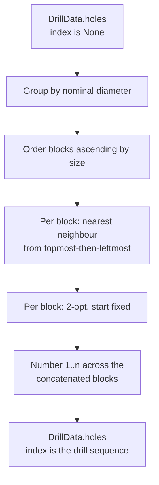

# ADR-0006: Toolpath ordering and hole numbering

**Status:** Accepted, amended in place: `RouteHoles(key=…)` is deleted rather than
retained. See Consequences. Amended again: every selection rule in the pipeline must be
total on geometry, not only the routing tie-break this ADR already pinned. See Decision
and Consequences. Amended a third time: the raw-measurement tie-break this ADR requires
now has one published implementation, a structural gate over the installed packages'
source enforces it, and the reader's own selection rule is recorded as the same class of
obligation. See Decision and Consequences. Amended a fourth time: reading a number
through `DrillData.numbered()` means *sorting by* it — the Excellon emitter grouped
holes into tool blocks and wrote each block in tuple order, which a since-repaired test
fixture could not distinguish from number order because the scramble never crossed a
block boundary. See Decision and Consequences. Amended a fifth time: the `1…n` set is
established by `RouteHoles` and enforced by `stompmodel.codec.from_document`; neither
`Hole`, `DrillData` nor `DrillData.numbered()` audits it, and the reasons are recorded.
See Decision and Consequences.

## Context

`Hole.index` was the position of a circle in Illustrator's content stream, and every
artifact printed it: drawing balloons, the schedule, the command-line report, and the
prose of four diagnostics. `SortHoles` ordered holes by `(-y_nm, x_nm)` for emission but
did not renumber them, so the number a machinist read bore no relation to the order they
drilled in.

Three consequences followed. Artwork order reached the artifacts: `(-y, x)` is not a
total order, so two holes at one point with different diameters tied and a stable sort
fell back to stream position — two files with identical geometry produced different
output. The drill file and the drawing disagreed about sequence, one being tool-major and
the other reading order, against the requirement that every artifact from one invocation
agree. And no artifact expressed a toolpath at all.

## Decision

**Geometry alone determines output.** If two input artifacts represent the same geometry,
this program's artifacts are byte-identical, whatever the inputs' internal structure or
element order.

**Amended: this binds every selection rule in the pipeline, not only routing's.** A rule
that picks one candidate over another — the reference outline, a coincident group's
survivor, a routed hole's tie-break — must be total on the candidates' own geometry: for
any two candidates it names a winner, and that winner does not change if the candidates'
order in the source is swapped. A rule that is total everywhere except one tie has an
untotal rule, because that tie is exactly where nothing but arrival order is left to
decide it. Where the measure a rule uses first can tie, the tie breaks on the candidates'
own further bounds, compared in a stated order, until the rule is total; a rule that
still cannot separate two candidates after that has proved they are interchangeable, and
either survives. This is enforced at the reader (`sources/ai_pdf.py`'s
`_largest_non_circular`, on each candidate's bounds), in `pipeline/dedupe.py`'s
`Deduplicate` and in `pipeline/route.py`'s `RouteHoles` (both composing `Hole.tie_break`,
below), and in `stompmodel.model.DrillData.rows()`'s within-row grouping (the same
property, for a different question — see Consequences).

**Amended again: the raw-measurement tie-break has one owner.** `Hole.tie_break`, a
read-only property on `stompmodel.model.Hole`, is the sole implementation of "the
measurement a hole was quantised from, compared as raw `x`, then raw `y`, then raw
`diameter`." It is a tie-break, not a ranking: a caller composes it *after* whatever term
it wants to sort or select by, once nominal geometry has already tied — `RouteHoles`
after its reading-order prefix, `Deduplicate` directly (a coincident group already ties
on nominal position and diameter by its own definition), `rows()` after nominal `x`. A
site restating the tuple by hand, rather than calling the property, is one rule with two
implementations — this ADR's own defect a level down, and the reason
`packages/stompmodel/tests/test_tie_break_owner.py` fails any tuple built from a hole's
raw `x`, raw `y` and raw `diameter` outside `stompmodel.model`. The gate lives in
`stompmodel`'s own suite — the rule's owner — per ADR-0008's ownership clause, and
resolves the packages it scans by reading each as text from
`tools.workspace_membership.member_package_dirs`, never by importing one (this package
sits below its siblings in the dependency order and must not import upward). It binds a
second consumer — in a package not yet in its scan — the moment that package's `src`
directory exists, and it names no stage: a fourth field on the raw measurement reaches
every consumer by editing the property once. The routing stage's reading-order prefix
(`-y_nm, x_nm` below) stays routing's own policy and is not folded into the property; only
this ADR changes it.

**Doctrine, not work.** The reader's `_largest_non_circular` selects one candidate over
another by a total order over the candidates' own bounds — the same class of rule
`Hole.tie_break` publishes, over a type (`sources/ai_pdf.py`'s path bounds) that
`stompdrill` owns rather than `stompmodel`. It has one implementation and one caller
today, which is why it stays where it is: publishing a rule beside a type it has no
second consumer for is the same defect this ADR corrects, inverted. The obligation is
recorded here so it is not rediscovered by a second reviewer: the moment a second caller
needs that selection, it is published beside the type it selects over, exactly as
`Hole.tie_break` now is.

`SortHoles` becomes `RouteHoles` in `pipeline/route.py`, recording itself as `"route"`.
It plans the drilling sequence and is the only place holes are ordered or numbered:

- Holes group by nominal diameter, blocks ascending by size, matching the `T1…Tn` that
  `DrillData.tools()` already assigns. Each tool is installed once and removed once.
- Each block routes independently of every other. The move between blocks happens while
  the bit is being changed, so it is not optimised.
- Within a block: nearest-neighbour with visited tracking from the block's
  topmost-then-leftmost hole, then 2-opt improvement with the start hole fixed, sweeping
  `i < j` and taking the first improving reversal.
- Ties break on `(-y_nm, x_nm)` — routing's own reading-order policy — and then on
  `Hole.tie_break`. Nominal position alone is not a total order: two holes can share one
  nominal point, and `min` would otherwise keep whichever the caller listed first.
  `Deduplicate` collapses such a pair, but stages are independent and a caller may omit
  it. Two holes equal in both nominal and measured values are interchangeable, so no
  output can distinguish them.

Every rule is geometric; none consults input order. ADR-0006, Figure 1 shows the phases.

`Hole.index` is the drill sequence: `1…n`, contiguous, typed `int | None` and defaulting
to `None`. `RouteHoles` establishes that set — it introduces the number and never rewrites
one, because no earlier stage sets it — and `codec.from_document` enforces it, a document
being the one place the numbers arrive from outside this workspace. `Hole` refuses a
number below 1 and nothing further, and `DrillData.numbered()` reads the numbers without
auditing them. `RawHole.index` is removed; diagnostics identify holes by coordinate
instead of by number, which is what frees the number to be assigned late.

`DrillData.numbered()` pairs each hole with its number and is the only place a number is
read. An emitter given unrouted data raises `EmitterError` naming the remedy.

**Amended a fourth time: reading through `numbered()` means sorting by the number it
yields.** `numbered()` deliberately returns tuple order, not drill order — so an artefact
whose own structure states a sequence (file position, for a format with no separate
number field) must sort the pairs by the first element before it presents them; reading
the pairs and trusting their order is reading past the one thing `numbered()` promises.
`emitters/step.py`'s `_drill_compound` sorts explicitly, and `emitters/excellon.py` now
does the same within each tool block. An artefact that instead states the number as an
explicit field per element — the schedule table, the JSON `holes` array, the CLI's
verbose report — does not assert a sequence through element position at all, so it owes
`numbered()` nothing beyond the pairing itself.

**Amended a fifth time: the numbering rule is enforced at the document reader and nowhere
else.** Three candidates were weighed and two refused. `DrillData.numbered()` cannot hold
it: a fixture proves an emitter read the model rather than counted the list by numbering a
hole out of range, and for a lone hole the only contiguous number is its own position — the
accidental equality the fixture exists to break. `DrillData` cannot hold it either:
`Deduplicate` composed after `RouteHoles` is a legal composition under ADR-0001, and it
drops a hole and leaves a gap; a legal composition owes a diagnostic, not a constructor
refusal raised from inside a stage. The reader can and does, and it is the only boundary
where the numbers were written by something this workspace did not run.

## Rationale

Numbering at the source and adding an offset per renderer were both rejected: the
program's own tool table starts at `T1`, so a hole index starting elsewhere is the model
disagreeing with itself, and an offset applied in five renderers is five chances to
disagree.

A provisional traversal-order number assigned by `quantise()` was rejected because it is
input-derived. A pipeline composed without `RouteHoles` would then emit artwork order and
silently forfeit the invariant — an exception to the rule inside the decision that
establishes it. With no provisional value there is nothing to leak, and refusing to emit
is louder than emitting the wrong sequence onto a sheet that reaches a shop floor.

Exact TSP is not attempted. Nearest-neighbour alone was measured leaving an avoidable
81 mm crossing on `packages/stompdrill/tests/fixtures/pax.ai`; adding 2-opt reached
that block's brute-force optimum of 144.6 mm. The heuristic is retained rather than
exact search because block sizes are unbounded, and no artifact claims the path is
shortest.

Each block's start is fixed geometrically rather than chosen to minimise the path. That
costs 3.2 mm of 141.4 mm on the same block, and buys a start a machinist can anticipate
and a rule that does not need a tie-break where two candidate starts are equidistant by
construction — which every mirror-symmetric block guarantees.

## Consequences

Hole numbers ascend along the drilling path, not across the page. A panel whose holes
read `5, 4, 7, 3, 6, 2` left-to-right is numbered correctly; following `1…n` traces the
route.

Ordering is no longer expressible as a sort key. **Amended: the ordering argument is
deleted, not retained.** An ordering that determines every hole number while reducing to
a lambda's name in provenance -- `"key": "<lambda>"`, identical for two opposite
orderings -- is a knob a consumer can be silently out of step with: provenance that
cannot reconstruct the decision it describes is worse than no provenance at all.
`RouteHoles()` takes no arguments and always routes by the documented rule; constructing
it with a `key` argument raises `TypeError`. If a named alternate ordering is ever wanted
it returns as a closed, nameable choice whose name is its own provenance, not as a bare
callable.

The `processing` record names the stage `"route"`, so a consumer matching `"sort"` breaks.
`Hole.index` in the JSON changes meaning from artwork identity to drill sequence, and
`hole_index` leaves every diagnostic payload.

Emitters accept less than before: unrouted data is an error rather than a drawing whose
balloons carry artwork order. `Source` implementations construct `RawHole` without an
index.

**Amended: the totality rule above is not only routing's.** Before this amendment, the
reference-outline candidate with the greatest measured area won on a strict `>`, so two
equal-area candidates were separated by nothing but which one the content stream named
first — a hole 110 mm away for the same artwork in two content-stream orders. Deduplicate
kept whichever member of a coincident group arrived first, which was only geometric
because `quantise()` happened to sort its input before handing it to the stage; the bare
stage, and any caller composing it without that upstream sort, was order-sensitive.
Both now pick a survivor by a tie-break total on the candidates' own bounds or
measurement, so neither depends on a sort run elsewhere. Deduplicate's tie-break is
`Hole.tie_break`; the outline's remains the reader's own, over a type it owns (see the
doctrine above).

**Amended a third time.** `Hole.tie_break` replaces two independent restatements of the
raw-measurement order — `pipeline/dedupe.py`'s and `pipeline/route.py`'s own tuple
literals, identical by execution but coupled by nothing — with one property both stages
call. `stompmodel.model.DrillData.rows()`'s within-row grouping, which broke a tie on
nominal `x` with a stable sort and so depended on arrival for two holes sharing a nominal
point, now breaks it the same way. "No rule may consult input order" is no longer only a
promise: `test_tie_break_owner.py` fails any tuple built from a hole's raw measurement
outside the module that owns it.

Changes to the block order, the routing rule, the tie-break, or the point at which numbers
are assigned are architectural changes to this decision.

**Amended a fourth time.** `emitters/excellon.py` grouped holes into tool blocks by
filtering `framed.holes` (tuple order) rather than the sorted pairs `numbered()` yields,
so within-block sequence was `RouteHoles`' tuple order rather than the hole's own number
— correct only because `cli.build_pipeline` happens to run `RouteHoles` last, a fact
about pipeline composition the emitter had no business depending on. It now sorts each
block by number, the same rule `emitters/step.py`'s `_drill_compound` already applied.
The guard that should have caught this scrambled hole numbers *across* tool blocks but
never *within* one, so the emitter's tool-major grouping restored ascending order by
accident and the test could not fail; the fixture now scrambles within a block too.

**Amended a fifth time.** `codec._read_holes` refuses a document whose hole numbers
repeat, exceed the hole count, or are absent; `Hole`'s own floor supplies the fourth fact,
and the four together admit only `1…n`. The refusal narrows acceptance solely over
documents outside the format — `to_document` reads its numbers through `numbered()`, which
refuses unrouted data — so the format version does not move. The reader is now stricter
than the writer: a caller who numbers holes by hand can serialise a document this reader
declines. That is accepted rather than overlooked; the writer serialises whatever the model
holds, and the model tolerates any positive numbering on purpose. A caller who builds such
a value in memory still reaches an artefact whose balloons repeat a number; putting the
rule at the trust boundary rather than in the value type is what buys that, and it is the
accepted cost. `_read_frame` hands `origin_nm` to `CoordinateFrame` whole, as it always did
for the basis vectors, so the three-component rule has one statement rather than two and a
long origin is refused instead of truncated. Each refusal carries a breach that must raise
it and a legitimate document that must not — in particular a document numbering its holes
out of tuple order, which is what separates a set check from a position check.
