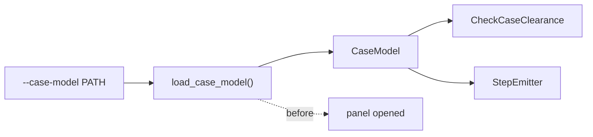

# ADR-0007: Case models and clearance

**Status:** Accepted, with the optional `stompdrill[step]` extra superseded by
[ADR-0009](0009-shared-model-package-and-dependency-order.md). The kernel is now
`stompgeom`'s unconditional dependency and reaches `stompdrill` through it.

This ADR retains the original extra decision and its rationale as history. The
current installation and the later frame and protocol amendments are described
below. The remaining decisions still apply.

## Context

`stompdrill` decides where holes go. At the time of this decision, it neither
showed the drilled enclosure nor checked whether the holes could be drilled.

Hammond distributes STEP models of its 1590-series enclosures. One parsed model
can support both tasks: a `StepEmitter` cuts the drilled part, and a
`CheckCaseClearance` stage checks whether each hole lands on drillable metal.
Both read the same `CaseModel`.

The existing ADRs did not cover an emitter reading geometry outside `DrillData`,
an optional runtime dependency, or byte identity delegated to a third-party
kernel. This decision established those boundaries before implementation.

## Decision

### Supply and load the enclosure model once

Enclosure geometry enters only as a supplied model. `stompdrill` never
synthesises an enclosure. `--case-model PATH` names a Hammond STEP file the
operator already has. The package reads it to verify clearance and cut the
holes it has already decided on. Acquiring the file is outside the package's
scope: `tools/fetch_case_model.py` is a stopgap downloader outside the distributed
package, with `stompcad` named as its successor.

`--case-model` resolves before the panel is opened, alongside the other flags.
An unreadable model, a model with no recognisable enclosure, or one with no
drillable face is a usage error. The parsed `CaseModel` is built once and feeds
both consumers, following ADR-0001's rule that shared facts are computed before
the emitter fan-out. ADR-0007, Figure 1 shows that flow.

*Figure 1: one case-model load supplies clearance checking and STEP emission.*

### Use one pinned geometry kernel

The original decision put `cadquery-ocp==7.9.3.1.1` in an optional
`stompdrill[step]` extra, leaving the base dependencies at `pikepdf>=9`.
`CheckCaseClearance` required that extra even when no STEP artefact was requested.
Cutting a valid solid and round-tripping an XCAF assembly required a kernel;
using it for clearance too avoided a second implementation of the same geometry
rules.

The protocol in `cad/base.py` was pure Python, so `import stompdrill` did not
import the kernel. The OCP implementations in `cad/step.py`, `cad/case.py`,
`cad/region.py` and `cad/loader.py` were imported lazily.

**Amended:** the extra is retired. `cadquery-ocp==7.9.3.1.1` is now an
unconditional dependency of `stompgeom`, so a plain install includes support for
`--case-model` and `--emit step=…`. The exact pin and the single geometry
implementation remain. `cad/base.py` still defines `CaseModel` in pure Python,
and `import stompdrill` still does not import the kernel. `cad/step.py` has been
replaced by `stompgeom.step`.

### Check clearance in the pipeline

`CheckCaseClearance` runs in the `Pipeline` alongside `Deduplicate`,
`ReviewGridTies`, `RouteHoles` and `CheckOutlineContainment`. Its diagnostics are
shared facts under ADR-0001: every artefact from an invocation must agree about
which holes are drillable. Checking only inside `StepEmitter` could let its
answer disagree with a drawing and would omit clearance diagnostics whenever no
STEP output was requested.

### Preserve geometry and appearance

Identical inputs must produce a geometrically and visually identical model.
Byte comparison is the preferred way to enforce that guarantee. A third-party
kernel writes the STEP bytes, so the guarantee needs an explicit scope.

To make bytes deterministic, pin `cadquery-ocp` exactly, copy
`FILE_NAME.time_stamp` from the source model, order cut tools by `Hole.index`,
and canonicalise the kernel's non-deterministic output. That currently includes
the translator's instance counter, assembly-occurrence names and colour chains.
The colour-chain order comes from pointer-hashed maps rebuilt on every write.
Byte identity across kernel versions is a non-goal.

Two exceptions govern byte comparison:

- Environment-derived metadata, such as timestamps, user and host names,
  absolute paths and random identifiers, is pinned to deterministic values
  where possible. Where this is impossible, exclude it from byte comparison and
  record the reason at the exclusion. This metadata describes the machine and
  must not affect the panel's geometry or appearance.
- Where byte identity is unreachable, tests must compare the underlying
  properties: the same solids and geometry, the same product names, and the same
  colours on the same parts. A semantically empty byte change must not cause the
  geometry or appearance check to be weakened or deleted.

The drilled solid's colour has a further exemption, discovered during
implementation and described under Consequences.

### Check the flat inner face's boundary

A hole is legal exactly when its footprint lies inside the flat inner face's
outer boundary eroded by `--case-margin`. Hammond plates are flat. For a
die-cast flat face, that outer boundary follows nominal wall thickness; bosses,
ribs and fillets are not nominal features and do not belong to it.

This is a permanent specialisation for die-cast enclosures. It builds one region
per model and tests containment per hole, avoiding a boolean intersection with
the full assembly for every hole. It does not cover an enclosure whose drilled
face is not flat.

### Register the inner surface as the frame datum

**Amended:** `build_frame` places `basis.origin_nm` on the flat face opposite
the drilled face: the inner surface against which a seated board rests.
`FaceFrame` documents this convention so a consumer with only `stompmodel`
installed can interpret the frame. The choice cannot be recovered from the
frame's values alone.

This datum does not change clearance verdicts. `cad.region.contains` and
`clearance_reason` project a canonical point and then replace its drill-axis
coordinate with the region's measured plane. The cutter, however, must start at
the drilled surface and pass through the plate. It therefore reads that plane
explicitly from the model instead of using the frame origin, following the same
explicit-plane approach as `cad.region`.

### Publish the checked registration

**Amended:** `CheckCaseClearance` reconciles the panel's drawn orientation with
the model's frame once. It is the stage that has both the enclosure
identification, available after quantisation, and the loaded model's frame,
available before it. It publishes the reconciled `FaceFrame` and drilled face
together as `DrillData.case`.

`StepEmitter` reads its frame and face from this checked registration. It must
not read `model.frame`/`model.face` directly and refuses with a typed error if no
registration is present. ADR-0007, Figure 1 still describes the shared parsed
model; classification and cutting use the registration's frame.

The original orientation amendment used `EnclosureMatch.rotated`, which records
that the panel matched a catalogue footprint after a quarter turn. This alone
cannot relate the panel's canonical axes to the model's independently chosen
axes. It also cannot say which way the artwork was turned.

Both possible quarter turns are orthonormal and right-handed, preserve the
normal `w`, and differ by a half turn in the plane. Their direction is therefore
a stated convention: a rotated panel maps `u` onto the model's `v`, and `v` onto
the model's negated `u`. The origin and `w` are unchanged.

If the correspondence cannot be established because no enclosure was identified
or the identified footprint has equal dimensions, the run emits
`case-orientation-unverifiable` at WARNING. In the equal-dimension case,
`cad.case.build_frame`'s deterministic but arbitrary in-plane tie-break provides
no evidence for either correspondence. Like `case-model-unverified`, the
warning reports an unavailable check. Making it an error would refuse square
enclosures the tool currently supports.

**Amended (T15):** the panel's measured extents decide whether a quarter turn is
needed. `EnclosureMatch.rotated` only describes a transposition relative to the
catalogue's printed row, and Hammond does not always print the larger dimension
first: `1590LB` is listed as 50.55 × 50.60 mm.

`CheckCaseClearance` therefore compares the two extents of
`ReferenceOutline.raw`, preserved through quantisation. Canonical *x* registers
on the model's `u`, which `build_frame` assigns to the larger measured span,
exactly when the drawn width is the larger drawn extent. The convention for the
direction of the turn remains unchanged. If no enclosure was identified, no
outline reached the stage, or the two drawn extents are equal, the model's frame
is used unchanged.

There is a limit to this comparison. It uses the precision of the artwork and
assumes the model's larger in-plane span is the physical dimension the catalogue
lists as larger. `_cross_check` sorts both footprints descending before
comparing them, so it does not verify that correspondence. If the catalogue
dimensions differ by less than the identification's 1.5 mm per-axis slack, the
turn depends on a distinction identification did not have to resolve. No
diagnostic marks this case. In the shipped catalogue, it affects `1590LB` alone,
whose dimensions differ by 0.05 mm.

Tests of this premise are inconclusive for the physical part. A solid built from
the catalogue's 50.55 × 50.60 mm dimensions gets `u` on the 50.60 mm axis, as the
rule requires. The real cached `1590LB` model measures 50.6 mm on both axes, with
a difference of 0.0 at kernel precision. Its `u` follows the lower-indexed free
axis tie-break. The supplied model therefore cannot verify whether the
catalogue's 0.05 mm ranking matches the casting.

## Rationale

### Alternatives to kernel clearance

Precomputing an obstruction map in the helper script would have kept
`stompdrill` dependency-free, but introduced another input that could become
inconsistent with the model. It would also sample a surface the B-rep can answer
exactly, while leaving the cutting implementation unresolved.

Measuring depth along the drill axis with one boolean per hole against the full
assembly was rejected for the box. All 76 spline faces of a real Hammond box
sit in the collision zone, requiring ray-vs-trimmed-NURBS work regardless of the
implementation. It also costs a boolean per hole instead of one region per
model. A baseline measured at the face centre was rejected because a central
rib could raise the baseline and let real collisions pass.

A pure-Python clearance backend was considered. It could parse and clip the two
planar faces, bounded by lines and circles, that define the flat-face play area.
The kernel was retained because `BRepClass_FaceClassifier` and
`BRepExtrema_DistShapeShape` answer containment and clearance against the actual
trimmed face. A hand-written implementation would tessellate arcs and need a
resolution parameter.

Originally, avoiding the `stompdrill[step]` extra was a possible reason to add a
pure-Python `cad` backend behind `CaseModel`. The extra's retirement removes
that reason, but the protocol still allows a clearance adapter that can run
without `stompgeom`.

### Keep cutting specific to the kernel model

`CaseModel` is the kernel-free clearance contract. Cutting is typed against
`OcpCaseModel`: `cut_shape` needs a live `TDocStd_Document` and runs
`BRepAlgoAPI_Cut`. A pure-Python backend cannot supply that document, so a
`CuttableCaseModel` protocol would have only one possible implementation.

The cutting path uses `OcpCaseModel` in `cut_shape`, `StepOptions.model`,
`OutputSettings.case_model`, `load_case_model`'s return type and the CLI's model
construction. `StepEmitter.__init__` refuses a missing or clearance-only model
with `EmitterError`, naming `--case-model` as the remedy. This catches the
unsupported model before `cut_shape` could access a member outside the
`CaseModel` contract and raise `AttributeError` during emission.

### Drive the check from the supplied model

Clearance checking belongs to `--case-model`, independent of `--emit`. A run
with a model and no STEP output must still report `hole-off-face` and the other
clearance diagnostics. Folding the check into `StepEmitter` would break that
requirement.

## Consequences

### Installation and imports

The original extra left `pip install stompdrill` unchanged. Running
`CheckCaseClearance` or `StepEmitter` without `stompdrill[step]` raised an error
naming the extra. `make_emitter` ran before the panel was opened, catching the
missing dependency before processing.

Every install now includes the kernel. `require_kernel` and `KernelUnavailable`
remain in `stompgeom.kernel` to report a broken environment; their hint names
the missing package. A kernel-free installation is no longer a supported choice.

The original optional extra cost more than the kernel's 62 MB wheel:
`cadquery-ocp` pulls in `vtk`, which pulls in `matplotlib`, although neither the
emitter nor the clearance stage uses them. Every install now carries that cost.
ADR-0009 accepted it when setting the workspace's dependency order, on the basis
that no one used a kernel-free configuration.

### Colour after cutting

The drilled solid's own colour cannot survive the cut through this kernel's
bindings. Reassigning colour through `XCAFDoc_ColorTool` after `SetShape`
replaces a label's geometry does not work at solid, component or per-face
granularity, either before or after `UpdateAssemblies`.
`STEPCAFControl_Writer` gives the replacement shape a synthesised wrapper
`PRODUCT` instead of reusing the original label's `PRODUCT_DEFINITION`, and
colour assignment cannot reach that new product.

Every untouched solid retains its colour. Only the one or two drilled faces
lose theirs, and the semantic-equivalence test records that exception.

### Public types and test boundaries

`CheckCaseClearance` and `load_case_model` are exported from
`packages/stompdrill/src/stompdrill/__init__.py`, following the rule for a new
stage or source. `StepEmitter` registers itself in `emitters/step.py`; it is not
exported from the root, because `import stompdrill` must not import 400 MB of
kernel.

**Amended:** the root also exports `OcpCaseModel`, the return type of
`load_case_model`. Without it, a consumer following the public signature reached
an `ImportError` suggesting `CaseModel`, which `StepEmitter.__init__` refuses.
The general rule, enforced by a test, is that every package-defined type named
in a root-exported signature must be reachable from the root. Values owned by
`stompmodel` are deliberately excluded under ADR-0009. Exporting `OcpCaseModel`
adds no kernel import: `stompdrill.cad` already imports `.loader`.

`CheckCaseClearance` depends only on `CaseModel`, so its rules can be tested with
a hand-built fake, just as emitters are tested with hand-built `DrillData`.
Kernel integration tests once skipped when the extra was absent. Those skips
are removed now that the kernel is unconditional; a missing kernel must fail.

**Amended:** `CaseModel` also declares `model_name`, identifying the supplied
file. `load_case_model` resolves it alongside `part`. Any other backend must
identify its source the same way, because the published drill document depends
on this value.

### Scope of the face check

An enclosure with a non-flat drilled face needs a new decision. The flat-face
specialisation is permanent.

Without a case model, the panel is still checked against its reference outline
and can produce `hole-outside-outline`, a warning under
[ADR-0002](0002-domain-quantisers.md). The model adds an error-level check against
the actual drilled face, beyond the published top view.
