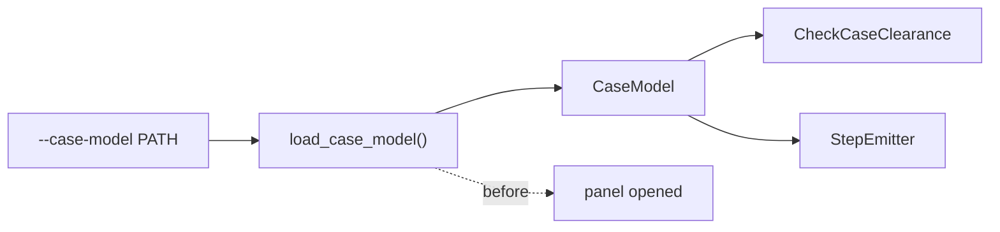

# ADR-0007: Case models and clearance

**Status:** Accepted

## Context

`aidrill` decides where holes go. Nothing downstream shows what the enclosure looks
like once they are drilled, and nothing checks that the holes can be drilled at all.

Hammond distributes a STEP model of every 1590-series enclosure. Given one, both gaps
close together: the model can be cut to produce the drilled part, and the same model
answers whether each hole lands on drillable metal. The two uses share one parse, so
they belong in one piece of work — a `StepEmitter` and a `CheckCaseClearance` stage,
both reading one parsed `CaseModel`.

No existing ADR contemplates an emitter that reads geometry other than `DrillData`, a
runtime dependency behind an optional extra, or byte identity delegated to a
third-party kernel. This ADR settles all three before either lands in code.

## Decision

**Enclosure geometry enters only as a supplied model.** `aidrill` never synthesises an
enclosure. `--case-model PATH` names a Hammond STEP file the operator already has; the
package reads it to verify clearance and to cut the holes it has already decided on,
and never to invent geometry of its own. Acquiring that file is not the package's job —
`tools/fetch_case_model.py` is a stopgap downloader outside the distributed package,
with a named successor in `aicad`.

**The kernel is an optional runtime extra, pinned exactly.** `cadquery-ocp==7.9.3.1.1`
lives under a new `aidrill[step]` extra; the base install stays `pikepdf>=9` and
nothing else. This holds even though clearance checking has no emitter output of its
own: **`aidrill[step]` is required to run `CheckCaseClearance` even when no STEP
artefact is emitted.** The emitter is what makes the kernel non-negotiable — cutting a
valid solid and round-tripping an XCAF assembly is kernel work under any algorithm —
and once that dependency is paid for, a second hand-rolled geometry implementation for
clearance would be a second authority on one question. `cad/base.py` defines the
`CaseModel` protocol in pure Python so that `import aidrill` never imports the kernel;
`cad/step.py`, `cad/case.py`, `cad/region.py` and `cad/loader.py` are the OCP-backed
implementation, imported lazily.

**Clearance is a stage, not emitter-local.** `CheckCaseClearance` runs in the
`Pipeline` alongside `Deduplicate`, `ReviewGridTies`, and `RouteHoles`, because its
diagnostics are shared facts under ADR-0001: every artefact from one invocation must
agree about which holes are drillable, not just the one artefact that happens to read
the case model. An emitter-local check would let a STEP file and a drawing disagree
about a hole the same invocation rejected.

**The guarantee is that identical inputs produce a geometrically and visually identical
model. Byte identity is how that is enforced, not what is promised.** A third-party
kernel now writes the STEP bytes, so the existing "geometry alone determines output"
guarantee is restated precisely rather than left to imply one `aidrill` does not make.

Byte identity is the preferred enforcement because it is cheap, total, and cannot be
argued with: pin `cadquery-ocp` exactly, copy `FILE_NAME.time_stamp` from the source
model rather than reading a clock, order cut tools by `Hole.index`, and canonicalise
what the kernel emits in a non-deterministic order — today the translator's instance
counter, the assembly-occurrence names, and the colour chains, whose order comes from
pointer-hashed maps rebuilt on every write. Byte identity across kernel versions is a
non-goal.

Two exemptions follow from stating the guarantee this way rather than the proxy.

*Environment-derived metadata* — timestamps, user names, host names, absolute paths,
random identifiers — is pinned to a deterministic value where possible and excluded
from byte comparison where not, with the reason recorded at the point of exclusion. It
describes the machine, not the panel, so it cannot make two models differ.

*Where byte identity is unreachable*, a test compares the property that actually
matters instead of its representation: the same solids with the same geometry, the same
product names, and the same colours attached to the same parts. A test that can only
express itself bitwise will, when the bytes drift for a semantically empty reason, be
weakened or deleted — and the real invariant goes with it. The obligation is to test the
property, and to reach for bytes only because they happen to be a sound proxy for it.

**The clearance rule is the flat inner face's outer boundary eroded by the margin.**
Hammond plates are flat, and a die-cast flat face's outer boundary is by construction
the locus of nominal wall thickness — bosses, ribs and fillets are not nominal and so
cannot be part of it. A hole is legal exactly when its footprint lies inside that
boundary eroded by `--case-margin`. This is a permanent specialisation for die-cast
enclosures, not a step towards a partial collision engine: it costs one region built
once per model and a containment test per hole, not a boolean intersection against the
full assembly, and it does not generalise to an enclosure whose drilled face is not
flat.

`--case-model` resolves before the panel is opened, alongside every other flag; a
model that cannot be read, contains no recognisable enclosure, or offers no drillable
face is a usage error, not a diagnostic. The parsed `CaseModel` is built once and feeds
both `CheckCaseClearance` and `StepEmitter`, matching ADR-0001's "shared facts computed
once before the emitter fan-out" applied to geometry, as shown in ADR-0007, Figure 1.

## Rationale

Precomputing an obstruction map in the helper script was rejected: it keeps `aidrill`
dependency-free but introduces a second input that can desync from the model it was
computed against, samples where an exact answer is available from the B-rep, and still
leaves the geometry surgery hand-written somewhere.

Measuring depth along the drill axis, with a boolean per hole against the full
assembly, was rejected for the box: all 76 spline faces of a real Hammond box sit in
the collision zone, so it needs ray-vs-trimmed-NURBS regardless of implementation, and
it pays a boolean per hole rather than one region built once. A baseline probed at the
face centre was also rejected, because it assumes the face centre is representative — a
part with a central rib would baseline high and wave real collisions through.

A pure-Python geometry backend for clearance was considered, since the flat-face play
area reads two planar faces bounded by lines and circles, which pure Python could parse
and clip. It is kept on the kernel anyway: `BRepClass_FaceClassifier` and
`BRepExtrema_DistShapeShape` answer containment and clearance exactly against the real
trimmed face, where hand-rolled code would tessellate the arcs and inherit a resolution
parameter. If the `aidrill[step]` requirement proves annoying, a pure-Python `cad`
backend can be added behind the `CaseModel` protocol later without touching the stage —
which is most of why the protocol exists rather than a concrete OCP type.

Treating the clearance check as emitter-local — folding it into `StepEmitter` — was
rejected because a caller who never requests `--emit step=…` would then get no
clearance diagnostics at all, contradicting "the check is driven by `--case-model`, not
by `--emit`": a panel run with `--case-model` but no STEP output must still report
`hole-off-face` and friends.

## Consequences

A base `pip install aidrill` is unchanged. Running `CheckCaseClearance` or
`StepEmitter` without `aidrill[step]` raises an error naming the remedy; `make_emitter`
runs before the panel is opened, so a missing extra is caught early rather than after
processing.

`aidrill[step]` costs more than its own 62 MB wheel: `cadquery-ocp` pulls in `vtk`
transitively, and `vtk` in turn pulls in `matplotlib`, neither of which the emitter or
the clearance stage uses. Paid only by an install that opts in, never by the base
package.

The colour promise above has one exemption, found while implementing it rather than
predicted: the *drilled* solid's own colour cannot survive the cut. Re-establishing
`XCAFDoc_ColorTool`'s assignment after `SetShape` replaces a label's geometry does not
work through this kernel's bindings, in any of solid, component or per-face
granularity, before or after `UpdateAssemblies` — `STEPCAFControl_Writer` gives a
replaced shape a synthesised wrapper `PRODUCT` instead of reusing the original label's
`PRODUCT_DEFINITION`, and no colour call reaches a product the writer had to invent.
Every solid the cut does not touch keeps its colour untouched; only the one or two
drilled faces lose theirs, and that loss is what the semantic-equivalence test records
rather than hides.

`CheckCaseClearance` and `load_case_model` each gain one line in
`src/aidrill/__init__.py`, matching how a new stage or source is exported. `StepEmitter`
does not: `emitters/step.py` registers itself, and `import aidrill` must not pull in
400 MB of kernel through the package root.

`CheckCaseClearance` depends only on the `CaseModel` protocol, never on the OCP
implementation, so the clearance rule is testable against a hand-built fake
`CaseModel` — the same move the repository already makes when it tests emitters with
hand-built `DrillData`. Kernel-backed integration tests skip when `aidrill[step]` is
absent.

A future enclosure whose drilled face is not flat is out of reach of this rule and
would need a new decision, not an extension of this one — the flat-face
specialisation is deliberate, not provisional.
