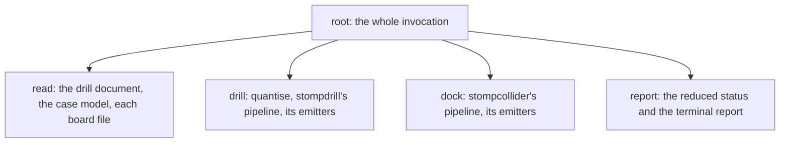

# ADR-0012: The progress protocol and optional kernel capabilities

**Status:** Accepted

## Context

`stompcad` composes both tools in one process. It imports `stompdrill` and
`stompcollider` as libraries rather than running them as subprocesses, so there
is no stream to scrape for progress: the tools return values, and what they
print is a finished report written for a person to read afterwards.

Some of that work takes minutes. `stompcollider` seats each board by sampling
poses along an insertion path, and the samples near contact are boolean
operations on real geometry. Nothing is printed while that runs, so a working
run and a stalled one look the same.

Reporting progress is therefore a shared interface rather than a feature of
either tool. Both must report into one structure, because `stompcad` shows one
position across a run that used both.

The kernel has a progress model of its own, and it is the same shape as the one
decided below. OpenCASCADE reports through `Message_ProgressIndicator`, which an
application subclasses, and `Message_ProgressScope`, which divides a range among
weighted sub-ranges. The consuming side is bound in Python:
`BRepAlgoAPI_BooleanOperation.Build`, `BOPAlgo_PaveFiller.Perform`,
`STEPCAFControl_Reader.Transfer` and `STEPControl_Reader.TransferRoots` all
accept a `Message_ProgressRange`. The producing side is not, so nothing in the
workspace can supply an indicator. Reproduce with:

```bash
.venv/bin/python -c "
from OCP.Message import Message_ProgressIndicator as I
try: type('X', (I,), {})()
except Exception as error: print(error)
"
```

`Message_ProgressIndicator` has no Python constructor because its OpenCASCADE
constructor is protected, and the binding's generator does not apply
pybind11's publicist idiom needed to bind one. Confirm this against the
headers for the pinned version before relying on it in a build. A scope built
on a default range is inert: advancing it leaves its value unchanged. One
kernel call is therefore the smallest piece of work the workspace can report
on, unless the missing side is supplied separately.

## Decision

### Progress is a weighted tree folded to one position

A run is a tree. The root spans the whole invocation, each node divides its own
span among its children, and each leaf is one discretely countable piece of
work. Reading the tree left to right and accumulating completed spans gives a
single number between 0 and 1, which is what a bar draws.

Branches reach different depths. A leaf deep inside the insertion search and a
leaf that is one whole emitter each occupy their allotted span, and neither
needs to know how far the other subdivided.

Two properties hold, and both are asserted by property tests rather than
assumed:

- **Partition.** A node's children divide its span exactly. No span is counted
  twice and none is lost.
- **Monotonicity.** The folded position never decreases.

**Progress describes work completed, not time.** No part of this design measures
elapsed time, estimates a remaining duration, or consults a previous run.

### The protocol lives in `stompmodel`

`stompmodel.progress` publishes:

- `Sink`, which receives the folded position and the labels of the active
  branch.
- `Scope`, which is one span of the run. `steps(count)` divides it into equal
  slots, `parts(*weights)` divides it in proportion to weights, and
  `label(name)` names the work happening in it.
- `NullScope` and its single instance `NO_PROGRESS`, which divide like a real
  scope and report nothing.
- `track(sink)`, which opens a run.

The module is plain Python and names no kernel type, so `stompmodel` gains no
dependency for it.
[ADR-0009](0009-shared-model-package-and-dependency-order.md) admits it under
rule 2 and names the `stompcad` behaviour requiring uniformity: the single bar.

Division returns an iterator of child scopes. Advancing the iterator closes the
previous slot and opens the next, so the partition holds by construction and a
caller cannot advance backwards. A scope that is never divided completes when
its parent's iterator moves on.

**An abandoned iterator claims the rest of its span.** A caller that leaves a
loop early — because a search found its answer, or because a count was an upper
bound — must not leave the node short of its end, which would stall the bar.
Three mechanisms provide this:

1. Completing a slot advances to that slot's end, and the recorded position is a
   maximum. A shortfall left inside a slot is absorbed when its parent moves on,
   so a child that under-reported cannot hold the bar back.
2. Division is a generator whose `finally` advances to the divided node's end,
   closing a node whose own iterator was abandoned.
3. `track()` is a context manager whose exit advances the run to 1.0, so a run
   ends complete however it was left.

Correctness rests on the first. A generator's `finally` runs when the generator
is closed or collected, which is not a moment the caller controls. The second
and third are cheap and are kept as defence in depth.

### `Stage` carries a weight and receives a scope

```python
class Stage(Protocol[T]):
    name: ClassVar[str]
    weight: ClassVar[float]
    def apply(self, data: T, scope: Scope = NO_PROGRESS) -> T: ...
```

`Pipeline.run` divides its span by the stages' declared weights, labels each
slot with its stage's name, and hands the slot to the stage. `Pipeline` acquires
no domain knowledge from this: a weight is a number, and the division is generic
over any sequence of stages.
[ADR-0001](0001-pipeline-and-emitter-adapters.md)'s rule that stages do not
depend on one another is untouched, because a scope carries no data and a stage
cannot read what another stage reported into it.

`scope` has a default, so `stage.apply(data)` and `Pipeline.run(data)` still
work for every existing caller. `weight` has none: each stage states its own
share.

### Weights are declared constants

A weight describes the expected shape of a stage's work. It is declared on the
stage class, reviewable in one place beside the code it describes, and revised
when that stage's structure changes.

A weight is never derived from a measurement taken on a developer's machine. A
number obtained from one machine's wall clock describes that machine, and does
not travel to another. OpenCASCADE takes the same approach: `BOPAlgo_PISteps`
holds fixed per-phase weights for a boolean operation.

### Counts come from structure

Each count is available before the work it divides begins, and is read from the
value in hand: the holes in `DrillData`, the distinct diameters, the validated
target list, the boards, the placements `Match` produced, a travel span derived
from bounding boxes. Each is one of three kinds:

- **Exact** counts the work that will happen.
- **A bound** counts the work a search may need, and the search may stop sooner.
  The rule for abandoned iterators is what makes an early stop sound: the
  remainder is claimed when the parent advances, and the bar moves in a jump.
  The jump describes the run accurately, because the remaining samples were
  not needed.
- **Indeterminate** admits that a loop's extent is not knowable beforehand, and
  takes one undivided leaf. `RouteHoles` supplies the example: `_two_opt`
  reverses segments until no reversal shortens the path, which terminates
  because every reversal strictly shortens, but the number of passes follows
  from the geometry. A tool's block is one leaf, and `RouteHoles` counts tools.

The general rule is to **count the work, not the iterations.** Where a loop
memoises, count its distinct keys: `Clashes`'s second stage counts distinct
board-pair seatings, not the combinations the product enumerates. Where a loop
cannot be counted, give it one leaf and say so.

Dividing a span equally among a loop's items is a deliberate simplification
where those items differ in cost. `Deduplicate` compares each hole against the
groups collected so far, so its last hole costs more than its first. The
insertion sweep's samples before contact are arithmetic, and those near it reach
the kernel. Predicting the difference would take the work itself.

### Callers other than `Pipeline` divide their own spans

Two substantial pieces of work sit outside both pipelines. Reading happens
before either: the drill document, the case model and each board file.
Quantisation happens between reading and `stompdrill`'s pipeline, and
`quantise()` is an ordinary function rather than a `Pipeline`. A `Scope` is
usable by any caller, and the protocol names `Pipeline` nowhere.



*Figure 1: the division `stompcad` opens on the root span.*

ADR-0012, Figure 1 shows where `Pipeline.run` fits: it receives the pipeline
children and divides them further. Reading, quantisation and the emitter runs
are divided by their own callers.

### A kernel capability that cannot be bound is optional, and probed by behaviour

The missing indicator can be supplied by a small pybind11 extension applying the
publicist idiom, overriding `Show` to report a position and `UserBreak` to
answer a cancellation request. `stompgeom` owns it, as the package holding the
workspace's kernel operations; `stompcollider` reaches the kernel only through
it. `stompgeom` publishes one function:

```python
def kernel_range(scope: Scope) -> Message_ProgressRange:
    """A range reporting into ``scope``, or an inactive range when unavailable."""
```

Callers pass the result to `Build`, `Perform` or `Transfer` unconditionally. An
inactive range is what those methods already receive by default, so the call
site reads the same whether the extension is present or not. Three rules govern
it.

**The extension is never built at run time.** Its absence is an ordinary
configuration. The structural tree above is a complete bar without it; the
extension subdivides its deepest leaves. A run reports nothing about whether it
was there, and a machine with a working install compiles nothing.

**Availability is decided by behaviour, never by a version comparison.** An ABI
mismatch between the extension and the binding does not raise at import. The
extension receives its own type registry, and the mismatch appears later as the
kernel declining the range it was passed. The probe therefore exercises the
capability: construct an indicator, start it, open a scope over a known count,
advance it, and confirm the reported position moves. `kernel_range` returns an
active range only when that succeeds, and an inactive one on any failure,
including import failure. The probe runs once per process and records its
result.

**A built extension is valid for one binding build.** It links the OpenCASCADE
libraries inside the installed wheel and must share that wheel's pybind11
internals identifier. Both differ by platform, and the library file names differ
by wheel build, so the extension resolves them from the installed distribution
rather than naming them. Either it is built against the installed wheel or it
declares an exact pin. An upgrade invalidates it, and the behaviour probe is
what notices.

## Rationale

### Fold a tree rather than estimate a total

A single global percentage needs an estimate of total work before the run
starts. Such an estimate has to come from memory of previous runs, and this
design keeps none: a bar derived from earlier runs would report a machine's
history rather than this run's work.

A weighted tree needs no estimate. Every count is read from the value in hand at
the moment its span opens, and a branch that subdivides further does so inside a
span already allotted to it. The cost is that the bar's speed varies, which the
declared weights moderate and do not remove.

### Pass the scope as a parameter

Two alternatives place the observer elsewhere, and both were rejected.

Injecting an observer through a stage's constructor separates the weights from
the stages they describe. The pipeline's caller would hold both the composition
and the shape of each stage's work, and a stage's own file would not say what
share it expects.

An ambient context variable makes a stage's reporting depend on state that no
signature names. A reader of `apply` could not tell where its report goes, and a
test would set global state to observe a stage. A parameter keeps the dependency
visible at the call site.

### Pin each package's stage set

`mypy` compares a class with `Stage` only where that class is assigned to a
`Stage[T]` slot. `stompdrill.CheckReferenceSize` is exported from the package
root and is not composed by `cli.build_pipeline`, so no such assignment exists
and the type checker never checks it against the protocol. A stage added later
in the same position would take no share of the bar, report nothing, and pass
every type check.

Each package therefore pins its own stage set.
`packages/stompdrill/tests/test_stage_registry.py` and
`packages/stompcollider/tests/test_stage_registry.py` enumerate the stage
classes their own package defines, match them against the expected names, and
check that each declares a weight and accepts a scope. Adding a stage becomes a
deliberate act: the set changes, the test fails, and the author chooses a weight
instead of inheriting one. The scan is written once per package because
`stompcollider`'s import gate forbids importing `stompdrill`, so no single
process may enumerate both.

### Widening `Stage` is a published change

`CheckReferenceSize` is available to library callers and not to the command
line, so the widened protocol reaches past the tools' own pipelines. Defaulting
`scope` keeps existing call sites working; declaring `weight` is what an
implementer must add. Recording the change here gives a later implementer one
place to read for both parts.

## Consequences

Nine classes implement `Stage` and change signature: `Deduplicate`,
`ReviewGridTies`, `RouteHoles`, `CheckOutlineContainment`, `CheckReferenceSize`
and `CheckCaseClearance` in `stompdrill`, and `Match`, `Seat` and `Clashes` in
`stompcollider`. Those with no sub-work accept the scope and do not divide it.

The quantisers are unaffected. `IdentifyHammondFootprint`,
`SnapDiametersToDrillTable` and `SnapPositions` carry `name` and `describe()`
but expose `quantise()` rather than `apply()`, and `quantise()` drives them in a
loop of its own. `Pipeline` never sees them, so they take a scope from their own
caller.

Neither tool gains a command-line option, and neither draws anything. Both
command lines pass `NO_PROGRESS`. `-v` / `--verbose` and the stage trace it
prints are unchanged: progress is a separate observer with a separate
audience.

Artefacts are unaffected. Ordering rules consult geometry, as
[ADR-0006](0006-toolpath-ordering-and-hole-numbering.md) requires, and a scope
is not an input. The instrument is a byte comparison of every artefact both
tools emit, run first with `NO_PROGRESS` and then with a recording sink
attached. When the kernel extension exists, the same comparison runs with a live
range as a behaviour-lock subject under
[ADR-0011](0011-behaviour-lock-and-its-blind-spots.md): passing an active range
changes which path the kernel takes, and the comparison establishes that it does
not change the geometry produced.

`stompcad` holds the only `Sink` that draws. It publishes `suspend()` from the
outset, so a later interactive picker can take the terminal from a renderer that
already exists. Without a terminal the renderer draws no bar, and the run still
reports what it did and what it produced. The bar's appearance — characters,
width, refresh policy, colour — is not decided here.

A working extension also makes long kernel operations interruptible, because
`UserBreak` is consulted inside the kernel. Without it, a boolean operation runs
to completion once started. What an interrupt leaves on disk, and how it is
reported, is not decided here.
