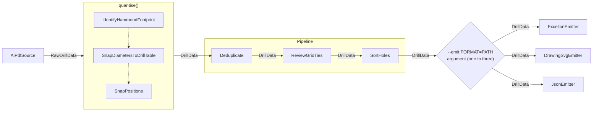

# ADR Rework Implementation Plan

> **For agentic workers:** REQUIRED SUB-SKILL: Use superpowers:subagent-driven-development (recommended) or superpowers:executing-plans to implement this plan task-by-task. Steps use checkbox (`- [ ]`) syntax for tracking.

**Goal:** Replace historical developer-note prose with three living ADRs, align repository documentation and docstrings to those decisions, and remove manufacturer PDFs and their obsolete maintenance paths.

**Architecture:** ADR-0001 defines the processing blocks and typed data flow, ADR-0002 defines domain answer sets and validation policy, and ADR-0003 defines the measurement-to-model quantisation boundary. The ADRs are updated before implementation or adjacent prose. A warning-only AST audit makes the 10-line docstring ceiling visible without blocking tests.

**Tech Stack:** Markdown, Mermaid, Python 3.10 `ast`, pytest, Ruff, mypy

## Global Constraints

- ADRs are living, definitive descriptions; Git is the history.
- Architectural changes update the ADR before or with implementation.
- ADR reasoning starts from current domain constraints, never incidents, experiments, reviews, or former code.
- ADRs may name stable contract types and classes but must not cite implementation source paths, line numbers, tests, or Git history.
- Mermaid figures are numbered within each ADR and referenced as `ADR-NNNN, Figure N`.
- ADR-0001 Figure 1 uses processing blocks as nodes, aggregate boundaries as subgraphs, and data types as edge labels.
- Solid labelled arrows represent typed data flow; dotted unlabelled arrows represent internal ordering.
- Every Python module, class, function, and async-function docstring is at most 10 physical lines; one to five lines is preferred.
- Docstring-length violations emit an aggregated warning and do not fail pytest.
- `docs/parts/dimensions.tsv` is the only manufacturer catalogue data distributed in the repository.
- Manufacturer PDFs are neither tracked nor required by tests or tooling.
- Runtime quantisation, pipeline, emitter, and catalogue behavior must not change.

---

## File Structure

### Create

- `docs/adr/0003-quantisation-boundary-and-ordering.md` — canonical numeric boundary and quantiser control flow.
- `tools/check_docstrings.py` — AST scanner returning over-length docstrings without deciding policy outcome.
- `tests/test_documentation.py` — scanner unit tests and warning-only repository audit.

### Rewrite

- `docs/adr/0001-pipeline-and-emitter-adapters.md` — processing architecture and artifact consistency.
- `docs/adr/0002-domain-quantisers.md` — domain answer sets and validation policy.
- `CLAUDE.md` — concise contributor contract pointing to the ADRs.
- `docs/parts/README.md` — upstream catalogue provenance and TSV maintenance contract.
- `docs/BACKLOG.md` — remaining work only.

### Modify

- `tools/build_catalogue.py` — TSV-only catalogue generation.
- `src/aidrill/enclosures.py` — regenerated catalogue with concise generated documentation.
- `tests/test_enclosures.py` — TSV generation and catalogue invariant tests only.
- `docs/parts/dimensions.tsv` — concise upstream/provenance header.
- `pyproject.toml` — remove `pdfplumber` and stale PDF comments.
- Python files under `src/`, `tests/`, and `tools/` — shorten docstrings and architectural comments without changing behavior.

### Delete from Git

- `docs/1590.pdf`.
- All 37 tracked `docs/parts/*.pdf` files; the existing `.gitignore` rule remains.

---

### Task 1: Add the non-blocking docstring audit

**Files:**
- Create: `tools/check_docstrings.py`
- Create: `tests/test_documentation.py`

**Interfaces:**
- Produces: `DocstringViolation(path: Path, line: int, owner: str, lines: int)`.
- Produces: `find_long_docstrings(roots: Iterable[Path], *, max_lines: int = 10) -> tuple[DocstringViolation, ...]`.
- The repository test warns once with all violations and always passes for length violations.

- [ ] **Step 1: Write the scanner tests before the scanner exists**

Create `tests/test_documentation.py` with a focused unit test and the repository audit:

```python
"""Repository documentation policy checks."""

from __future__ import annotations

import warnings
from pathlib import Path

from tools.check_docstrings import find_long_docstrings

REPO = Path(__file__).resolve().parent.parent
PYTHON_ROOTS = (REPO / "src", REPO / "tests", REPO / "tools")


def test_the_scanner_reports_the_owner_and_physical_line_count(tmp_path: Path):
    sample = tmp_path / "sample.py"
    sample.write_text('def example():\n    """one\n    two\n    three"""\n', encoding="utf-8")

    (violation,) = find_long_docstrings((sample,), max_lines=2)

    assert violation.path == sample
    assert violation.line == 2
    assert violation.owner == "example"
    assert violation.lines == 3


def test_repository_docstrings_respect_the_ten_line_ceiling():
    violations = find_long_docstrings(PYTHON_ROOTS)
    if violations:
        details = "\n".join(
            f"{item.path.relative_to(REPO)}:{item.line}: "
            f"{item.owner} spans {item.lines} lines"
            for item in violations
        )
        warnings.warn(f"docstrings over 10 lines:\n{details}", stacklevel=1)
```

- [ ] **Step 2: Run the focused test and verify the missing module fails**

Run:

```bash
.venv/bin/python -m pytest -o addopts= tests/test_documentation.py -v
```

Expected: collection fails with `ModuleNotFoundError: No module named 'tools.check_docstrings'`.

- [ ] **Step 3: Implement the AST scanner**

Create `tools/check_docstrings.py`:

```python
"""Find Python docstrings that exceed a physical-line limit."""

from __future__ import annotations

import ast
from collections.abc import Iterable, Iterator
from dataclasses import dataclass
from pathlib import Path

__all__ = ["DocstringViolation", "find_long_docstrings"]

_OWNER_NODES = (ast.Module, ast.ClassDef, ast.FunctionDef, ast.AsyncFunctionDef)


@dataclass(frozen=True, slots=True)
class DocstringViolation:
    """Location and size of one over-length docstring."""

    path: Path
    line: int
    owner: str
    lines: int


def _python_files(roots: Iterable[Path]) -> Iterator[Path]:
    for root in roots:
        if root.is_file():
            yield root
        else:
            yield from sorted(root.rglob("*.py"))


def find_long_docstrings(
    roots: Iterable[Path], *, max_lines: int = 10
) -> tuple[DocstringViolation, ...]:
    """Return module and item docstrings longer than ``max_lines``."""
    violations: list[DocstringViolation] = []
    for path in _python_files(roots):
        tree = ast.parse(path.read_text(encoding="utf-8"), filename=str(path))
        for node in ast.walk(tree):
            if not isinstance(node, _OWNER_NODES) or not node.body:
                continue
            expression = node.body[0]
            if not isinstance(expression, ast.Expr):
                continue
            value = expression.value
            if not isinstance(value, ast.Constant) or not isinstance(value.value, str):
                continue
            lines = value.end_lineno - value.lineno + 1
            if lines <= max_lines:
                continue
            owner = "<module>" if isinstance(node, ast.Module) else node.name
            violations.append(
                DocstringViolation(path, value.lineno, owner, lines)
            )
    return tuple(violations)
```

- [ ] **Step 4: Run the focused tests and record the baseline warning**

Run:

```bash
.venv/bin/python -m pytest -o addopts= tests/test_documentation.py -v
```

Expected: `2 passed` and one aggregated warning listing the current over-length docstrings. The warning is the expected baseline, not a failure.

- [ ] **Step 5: Lint the scanner and its tests**

Run:

```bash
.venv/bin/ruff check tools/check_docstrings.py tests/test_documentation.py
```

Expected: no findings.

- [ ] **Step 6: Commit the audit**

```bash
git add tools/check_docstrings.py tests/test_documentation.py
git commit -m "test: report over-length docstrings"
```

---

### Task 2: Rewrite the architectural decision records

**Files:**
- Modify: `docs/adr/0001-pipeline-and-emitter-adapters.md`
- Modify: `docs/adr/0002-domain-quantisers.md`
- Create: `docs/adr/0003-quantisation-boundary-and-ordering.md`

**Interfaces:**
- ADR-0001 owns processing responsibilities and typed flow.
- ADR-0002 owns domain answer sets, enclosure policy, catalogue authority, and artifact withholding.
- ADR-0003 owns the float-millimetre to integer-nanometre boundary and quantiser order.

- [ ] **Step 1: Rewrite ADR-0001 around current processing responsibilities**

Use the title `ADR-0001: Processing architecture and artifact consistency` and retain only:

```markdown
**Status:** Accepted

## Context
## Decision
## Rationale
## Consequences
```

The binding statements are:

- `AiPdfSource` produces unquantised `RawDrillData`.
- `quantise()` is one processing phase that produces canonical `DrillData`.
- `Pipeline` groups `Deduplicate`, `ReviewGridTies`, and `SortHoles` as independent stages.
- shared facts are computed once before emission;
- emitters serialize and perform presentation-only transformations;
- the invocation selects one to three emitters through `--emit FORMAT=PATH`;
- diagnostics and processing provenance travel with `DrillData`.

Include this numbered figure, followed by the caption `Figure 1 — Processing blocks, aggregate boundaries, and transferred document types.`:



Refer to it from the Decision or Rationale text as `ADR-0001, Figure 1`; the caption must not be the figure's only mention.

Do not include old scripts, incidents, option scorecards, test counts, action items, or speculative sources/emitters.

- [ ] **Step 2: Rewrite ADR-0002 around authority and safety policy**

Use the title `ADR-0002: Domain answer sets and validation policy` with the same four-section shape. Include a compact answer-set table and an enclosure-outcome table.

State only current rules:

- positions land on the declared grid;
- diameters land on the selected and optionally narrowed drill standard;
- outlines match catalogue footprints from `docs/parts/dimensions.tsv`;
- an unmatched diameter is an error and the hole is excluded;
- any error withholds every artifact;
- undeclared enclosure matching distinguishes unique, unknown, and ambiguous outcomes;
- a declared case must be positively verified or produces an error;
- a 2-D outline identifies a footprint, never a unique part;
- the `Background` outline uses backplate dimensions;
- Hammond's website is upstream, while no manufacturer PDF is repository data.

Retain only the current backplate arithmetic: a face-drawn 1590B is approximately 1.9 mm from both its own backplate and the nearby 1590BS footprint, so tolerance widening cannot uniquely identify it.

- [ ] **Step 3: Write ADR-0003 for the quantisation boundary**

Use the title `ADR-0003: Quantisation boundary and ordering` and explain:

- source measurements are finite float millimetres;
- canonical model lengths are integer nanometres;
- answer-set selection uses the exact scaled decimal measurement;
- preliminary nanometre rounding is forbidden because it can manufacture a midpoint tie;
- enclosure runs first, diameters second, positions last;
- enclosure errors terminate the phase before hole work;
- rejected diameters omit only their holes while retaining diagnostics;
- processing records describe only work that actually ran;
- representation rounding and grid tie-breaking answer different questions;
- numeric rules require an observable model or artifact invariant.

Add `Figure 1 — Quantisation control flow and termination points.` as a numbered Mermaid flowchart, and refer to it in prose as `ADR-0003, Figure 1`. Use solid arrows for data/control flow and label outcome branches (`error`, `accepted`, `rejected`); do not introduce implementation-history nodes.

- [ ] **Step 4: Check the ADRs for forbidden narrative and stale identifiers**

Run:

```bash
rg -n 'Supersedes|Amended|Action Items|driving incident|earlier version|used to|review found|tests/|src/|docs/1590\.pdf' docs/adr
```

Expected: no matches. Then read all three ADRs once end-to-end and confirm each architectural rule has one owner.

- [ ] **Step 5: Validate Mermaid when a local renderer exists**

Run:

```bash
if command -v mmdc >/dev/null; then
  mmdc -i docs/adr/0001-pipeline-and-emitter-adapters.md -o /tmp/adr-0001-rendered.md
  mmdc -i docs/adr/0003-quantisation-boundary-and-ordering.md -o /tmp/adr-0003-rendered.md
fi
```

Expected: both Markdown files render when `mmdc` is installed; otherwise record that visual validation was unavailable and continue.

- [ ] **Step 6: Commit the authoritative ADRs before implementation changes**

```bash
git add docs/adr/0001-pipeline-and-emitter-adapters.md docs/adr/0002-domain-quantisers.md docs/adr/0003-quantisation-boundary-and-ordering.md
git commit -m "docs: define the current aidrill architecture"
```

---

### Task 3: Remove manufacturer PDFs and PDF-dependent catalogue tooling

**Files:**
- Delete: `docs/1590.pdf`
- Delete: tracked `docs/parts/*.pdf` files
- Modify: `tools/build_catalogue.py`
- Modify: `tests/test_enclosures.py`
- Modify: `pyproject.toml`
- Regenerate: `src/aidrill/enclosures.py`

**Interfaces:**
- `read_drawings(tsv_path) -> set[tuple[str, int, int, int]]` remains the sole input path.
- `render_module(catalogue) -> str` and `main(argv) -> int` remain unchanged for callers.
- `extract_series` and all PDF-row parsing helpers are removed.

- [ ] **Step 1: Verify the exact tracked deletion set**

Run:

```bash
git ls-files 'docs/1590.pdf' 'docs/parts/*.pdf'
```

Expected: `docs/1590.pdf` plus exactly 37 files under `docs/parts/`. Do not delete `docs/parts/dimensions.tsv` or `docs/parts/README.md`.

- [ ] **Step 2: Reduce the catalogue tests to the checked-in authority**

In `tests/test_enclosures.py`:

- remove `DATASHEET`, `_half_up_mm`, both cross-document tests, `TestTheCollapseToBaseDesignators`, `TestWhichSeriesRowsCountAsData`, and the runtime-`pdfplumber` inspection;
- remove imports used only by those tests (`ROUND_HALF_UP`, `Decimal`, `ClassVar`);
- retain the generated-module round trip, TSV reader behavior, exact nanometre conversion, catalogue counts, footprint grouping, immutability, and deterministic ordering;
- shorten every remaining docstring to at most 10 lines.

Run the focused test before changing the generator:

```bash
.venv/bin/python -m pytest -o addopts= tests/test_enclosures.py -v
```

Expected: the retained tests pass against the current generator; the removed-PDF behavior is no longer part of the test contract.

- [ ] **Step 3: Simplify the generator to TSV-only input**

In `tools/build_catalogue.py`:

- replace the module docstring with a maximum-five-line TSV-generation contract;
- remove `re`, `Iterator`, and `Sequence` imports;
- reduce `__all__` to `read_drawings`, `render_module`, and `main`;
- remove `FAMILY`, `_PART`, `_COLOR`, `_FLANGE`, `_WATERTIGHT`, PDF column constants, `_base_designator`, `_dimensioned_row`, `_dimensioned_rows`, and `extract_series`;
- simplify `read_drawings` so its reason is authority and uniqueness, not comparison with another extractor;
- shorten `_nanometres`, `_drawing_row`, `render_module`, and `main` docstrings;
- rewrite the generated `_HEADER` to at most 10 physical docstring lines and remove every PDF/test/history reference.

- [ ] **Step 4: Remove the development dependency and stale configuration prose**

In `pyproject.toml`, change:

```toml
dev = ["pytest", "pytest-cov", "hypothesis", "ruff", "mypy", "mutmut", "pdfplumber"]
```

to:

```toml
dev = ["pytest", "pytest-cov", "hypothesis", "ruff", "mypy", "mutmut"]
```

Delete the comments that justify `pdfplumber` and revise the `mutmut` copy comment to mention only the TSV and generator.

- [ ] **Step 5: Remove the tracked PDFs and regenerate the catalogue**

After confirming the list from Step 1, remove exactly those tracked PDFs, then run:

```bash
git add -u docs/1590.pdf
git rm docs/parts/*.pdf
.venv/bin/python tools/build_catalogue.py
```

Expected: `37 base parts`, `37 distinct sizes`, and `26 distinct footprints`; only documentation in `src/aidrill/enclosures.py` changes, not catalogue rows.

- [ ] **Step 6: Verify the TSV-only maintenance path**

Run:

```bash
.venv/bin/python -m pytest -o addopts= tests/test_enclosures.py -v
.venv/bin/ruff check tools/build_catalogue.py tests/test_enclosures.py src/aidrill/enclosures.py
git ls-files 'docs/1590.pdf' 'docs/parts/*.pdf'
rg -n 'pdfplumber|docs/1590\.pdf|extract_series' tools/build_catalogue.py tests/test_enclosures.py src/aidrill/enclosures.py pyproject.toml
```

Expected: tests and Ruff pass; both searches produce no output.

- [ ] **Step 7: Commit the catalogue maintenance change and PDF deletions**

```bash
git add docs/1590.pdf docs/parts pyproject.toml tools/build_catalogue.py tests/test_enclosures.py src/aidrill/enclosures.py
git commit -m "chore: remove manufacturer PDF dependencies"
```

---

### Task 4: Align repository documentation with the ADRs

**Files:**
- Modify: `CLAUDE.md`
- Modify: `docs/parts/README.md`
- Modify: `docs/parts/dimensions.tsv`
- Modify: `docs/BACKLOG.md`

**Interfaces:**
- `CLAUDE.md` is the concise contributor entry point, not a second architecture specification.
- `docs/parts/README.md` explains maintenance of the distributed TSV.
- `docs/BACKLOG.md` contains only current, unscheduled work.

- [ ] **Step 1: Rewrite `CLAUDE.md` as a compact contributor guide**

Keep these sections and remove historical narratives:

```markdown
# CLAUDE.md
## Purpose and scope
## Development commands
## Architecture
## Domain invariants
## Parsing constraints
## Documentation rules
## Testing rules
```

The Architecture section links to ADR-0001 through ADR-0003 and summarizes, without re-arguing, the source/quantisation/pipeline/emitter boundaries. The Documentation section states ADR authority, diagram numbering, the 10-line docstring ceiling, and ADR-before-code ordering. Remove test counts, mutation anecdotes, removed flags, former behavior, PDF dependencies, and stale architecture diagrams.

- [ ] **Step 2: Rewrite the catalogue README and TSV header**

`docs/parts/README.md` must state only:

- Hammond's product website is upstream;
- manufacturer drawings may exist locally but are ignored and not redistributed;
- `dimensions.tsv` contains one row per base part in published metric dimensions;
- `source` is human provenance and does not affect generation;
- top-view/backplate dimensions are not drilled-face dimensions;
- `tools/build_catalogue.py` validates exact nanometres and regenerates the module;
- fine dimensions yield 26 footprints and some require `--case` to disambiguate.

Replace the `dimensions.tsv` header with concise upstream, backplate, and source-column statements. Do not refer to local PDF paths, the backlog, extraction experiments, or a coarse catalogue.

- [ ] **Step 3: Rewrite the backlog as remaining work only**

Delete the completed catalogue-adoption and integer-micron sections. Compact the remaining entries—paired redundancy review, mypy strictness, import cost, and chain-dimension coverage—to current status, constraint, and acceptance condition. Remove former test counts, review chronology, and assertions that long module docstrings are desirable.

- [ ] **Step 4: Check adjacent documentation for stale authority**

Run:

```bash
rg -n '\(SPEC §|docs/SPEC|docs/superpowers/spec/SPEC|docs/1590\.pdf|pdfplumber|integer microns|pt_to_mm|earlier version|driving incident' CLAUDE.md docs/adr docs/parts docs/BACKLOG.md
```

Expected: no matches.

- [ ] **Step 5: Commit the aligned documentation**

```bash
git add CLAUDE.md docs/parts/README.md docs/parts/dimensions.tsv docs/BACKLOG.md
git commit -m "docs: align repository guidance with ADRs"
```

---

### Task 5: Shorten core and boundary docstrings

**Files:**
- Modify: `src/aidrill/__init__.py`
- Modify: `src/aidrill/errors.py`
- Modify: `src/aidrill/formatting.py`
- Modify: `src/aidrill/geometry.py`
- Modify: `src/aidrill/model.py`
- Modify: `src/aidrill/protocols.py`
- Modify: `src/aidrill/quantise.py`
- Modify: `src/aidrill/sources/__init__.py`
- Modify: `src/aidrill/sources/ai_pdf.py`
- Modify: `src/aidrill/tolerance.py`
- Modify: `src/aidrill/units.py`

**Interfaces:**
- No signature, value, diagnostic, control-flow, or import behavior changes.
- Each docstring is at most 10 physical lines and normally at most five.

- [ ] **Step 1: Shorten module and public-contract docstrings**

For each file, retain only its local responsibility and non-obvious invariant. Replace implementation-history arguments with direct constraints. Examples:

```python
def scaled_nm(mm: float) -> Decimal:
    """Scale a measurement exactly without selecting a nanometre.

    Quantisers compare this value directly with their answer sets so a
    preliminary rounding cannot manufacture a midpoint tie. See ADR-0003.
    """
```

```python
class Source(Protocol):
    """Read artwork as unquantised finite millimetre measurements."""
```

Do not copy full ADR reasoning into these files.

- [ ] **Step 2: Shorten private-item docstrings and architectural comments**

Audit every class/function docstring and nearby multi-line comment in the listed files. Preserve formula definitions, units, frame conventions, and validation predicates; remove bug chronology, former implementations, review/test anecdotes, and hypothetical callers unrelated to the local contract.

- [ ] **Step 3: Verify the core group**

Run:

```bash
.venv/bin/python -m pytest -p no:cacheprovider -o addopts= tests/test_model.py tests/test_geometry.py tests/test_ai_pdf.py tests/test_units.py tests/test_tolerance.py tests/test_quantise.py --tb=short
.venv/bin/ruff check src/aidrill/__init__.py src/aidrill/errors.py src/aidrill/formatting.py src/aidrill/geometry.py src/aidrill/model.py src/aidrill/protocols.py src/aidrill/quantise.py src/aidrill/sources src/aidrill/tolerance.py src/aidrill/units.py
.venv/bin/mypy src/aidrill
```

Expected: all commands pass.

- [ ] **Step 4: Confirm this group has no long docstrings**

Run:

```bash
.venv/bin/python - <<'PY'
from pathlib import Path
from tools.check_docstrings import find_long_docstrings

files = (
    Path("src/aidrill/__init__.py"),
    Path("src/aidrill/errors.py"),
    Path("src/aidrill/formatting.py"),
    Path("src/aidrill/geometry.py"),
    Path("src/aidrill/model.py"),
    Path("src/aidrill/protocols.py"),
    Path("src/aidrill/quantise.py"),
    Path("src/aidrill/sources"),
    Path("src/aidrill/tolerance.py"),
    Path("src/aidrill/units.py"),
)
assert not find_long_docstrings(files)
PY
```

Expected: no assertion failure.

- [ ] **Step 5: Commit the core prose cleanup**

```bash
git add src/aidrill/__init__.py src/aidrill/errors.py src/aidrill/formatting.py src/aidrill/geometry.py src/aidrill/model.py src/aidrill/protocols.py src/aidrill/quantise.py src/aidrill/sources src/aidrill/tolerance.py src/aidrill/units.py
git commit -m "docs: make core docstrings concise"
```

---

### Task 6: Shorten pipeline, CLI, and emitter docstrings

**Files:**
- Modify: `src/aidrill/cli.py`
- Modify: `src/aidrill/pipeline/__init__.py`
- Modify: `src/aidrill/pipeline/dedupe.py`
- Modify: `src/aidrill/pipeline/diameters.py`
- Modify: `src/aidrill/pipeline/enclosure.py`
- Modify: `src/aidrill/pipeline/snap.py`
- Modify: `src/aidrill/pipeline/validate.py`
- Modify: `src/aidrill/emitters/__init__.py`
- Modify: `src/aidrill/emitters/base.py`
- Modify: `src/aidrill/emitters/drawing_svg.py`
- Modify: `src/aidrill/emitters/excellon.py`
- Modify: `src/aidrill/emitters/json_out.py`
- Modify: `src/aidrill/pipeline/sort.py`

**Interfaces:**
- No runtime behavior changes.
- Module prose points to ADR ownership rather than duplicating architecture.

- [ ] **Step 1: Replace stale module-level architecture narratives**

Remove all `(SPEC §N)` citations. Module headers state only responsibility and the binding local rule, for example:

```python
"""Quantisers and post-quantisation pipeline stages.

Quantisers form the mandatory boundary in ADR-0003; stages are independent
``DrillData -> DrillData`` transforms composed by ``Pipeline``.
"""
```

- [ ] **Step 2: Shorten item docstrings without weakening contracts**

For CLI builders, quantisers, stages, and emitters, keep effective-input rules, ordering constraints, diagnostic meanings, format limitations, and numeric formulas. Move system-level reasoning to the ADRs. Delete former-state prose and tests-as-evidence.

Pay particular attention to `build_pipeline`, `SnapPositions`, `ReviewGridTies`, `IdentifyHammondFootprint`, and emitter module headers, which currently contain the longest duplicated architectural explanations.

- [ ] **Step 3: Verify the processing and output group**

Run:

```bash
.venv/bin/python -m pytest -p no:cacheprovider -o addopts= tests/test_cli.py tests/test_pipeline.py tests/test_snap.py tests/test_diameters.py tests/test_enclosure.py tests/test_excellon.py tests/test_drawing_svg.py tests/test_json_emitter.py tests/test_emitter_registry.py --tb=short
.venv/bin/ruff check src/aidrill/cli.py src/aidrill/pipeline src/aidrill/emitters
.venv/bin/mypy src/aidrill
```

Expected: all commands pass.

- [ ] **Step 4: Confirm this group has no long docstrings or stale SPEC citations**

Run:

```bash
.venv/bin/python - <<'PY'
from pathlib import Path
from tools.check_docstrings import find_long_docstrings

assert not find_long_docstrings(
    (Path("src/aidrill/cli.py"), Path("src/aidrill/pipeline"), Path("src/aidrill/emitters"))
)
PY
rg -n '\(SPEC §|docs/SPEC|earlier version|driving incident|review found' src/aidrill
```

Expected: both checks produce no findings.

- [ ] **Step 5: Commit the processing prose cleanup**

```bash
git add src/aidrill/cli.py src/aidrill/pipeline src/aidrill/emitters
git commit -m "docs: make processing docstrings concise"
```

---

### Task 7: Shorten test and tool docstrings

**Files:**
- Modify: `tests/conftest.py`
- Modify: `tests/__init__.py`
- Modify: `tests/test_ai_pdf.py`
- Modify: `tests/test_cli.py`
- Modify: `tests/test_diameters.py`
- Modify: `tests/test_drawing_svg.py`
- Modify: `tests/test_emitter_registry.py`
- Modify: `tests/test_enclosure.py`
- Modify: `tests/test_enclosures.py`
- Modify: `tests/test_excellon.py`
- Modify: `tests/test_geometry.py`
- Modify: `tests/test_json_emitter.py`
- Modify: `tests/test_model.py`
- Modify: `tests/test_pipeline.py`
- Modify: `tests/test_quantise.py`
- Modify: `tests/test_snap.py`
- Modify: `tests/test_tolerance.py`
- Modify: `tests/test_units.py`
- Modify: `tools/build_catalogue.py`

**Interfaces:**
- Test assertions and fixture values remain unchanged except for PDF-dependent tests removed in Task 3.
- Test prose explains the invariant and why fixture values distinguish it, not how a defect was discovered.

- [ ] **Step 1: Remove stale citations and historical test narratives**

Delete every `(SPEC §N)` citation. Reduce module headers to test scope. Rewrite long test docstrings to state:

1. the invariant under test;
2. only when necessary, why the chosen fixture prevents a false positive.

Do not retain mutation history, former fixture attempts, review chronology, or descriptions of implementations the test no longer exercises.

- [ ] **Step 2: Preserve meaningful fixture discrimination concisely**

For tests whose numbers deliberately separate two predicates, retain that distinction in at most five lines. Example:

```python
def test_the_rendered_table_is_ordered_by_footprint_then_height():
    """Use opposing axis and height orders so a transposed sort cannot pass."""
```

Do not alter assertions merely to make the explanation shorter.

- [ ] **Step 3: Run the complete docstring audit**

Run:

```bash
.venv/bin/python -m pytest -o addopts= tests/test_documentation.py -v
.venv/bin/python - <<'PY'
from pathlib import Path
from tools.check_docstrings import find_long_docstrings

violations = find_long_docstrings((Path("src"), Path("tests"), Path("tools")))
assert not violations, violations
PY
```

Expected: the test passes without emitting a length warning, and the explicit assertion passes.

- [ ] **Step 4: Run the full suite and lint all prose-touched Python files**

Run:

```bash
.venv/bin/python -m pytest -p no:cacheprovider -o addopts= --tb=short
.venv/bin/ruff check src tests tools
.venv/bin/mypy src/aidrill
```

Expected: all commands pass.

- [ ] **Step 5: Commit the test prose cleanup**

```bash
git add tests tools/build_catalogue.py
git commit -m "docs: make test docstrings concise"
```

---

### Task 8: Final repository verification

**Files:**
- Verify all files changed by Tasks 1–7.

**Interfaces:**
- ADRs, code, documentation, tests, and distributed catalogue data agree.

- [ ] **Step 1: Verify no forbidden tracked artifacts or stale references remain**

Run:

```bash
test -z "$(git ls-files 'docs/1590.pdf' 'docs/parts/*.pdf')"
git grep -n -E '\(SPEC §|docs/SPEC|docs/superpowers/spec/SPEC|docs/1590\.pdf|pdfplumber' -- ':!docs/superpowers/**'
```

Expected: the tracked-PDF assertion passes and `git grep` prints no matches.

- [ ] **Step 2: Verify docstring policy and generated catalogue identity**

Run:

```bash
.venv/bin/python - <<'PY'
from pathlib import Path
from tools.check_docstrings import find_long_docstrings

violations = find_long_docstrings((Path("src"), Path("tests"), Path("tools")))
assert not violations, violations
PY
.venv/bin/python tools/build_catalogue.py docs/parts/dimensions.tsv /tmp/aidrill-enclosures.py
cmp /tmp/aidrill-enclosures.py src/aidrill/enclosures.py
```

Expected: no docstring violations and byte-identical generated catalogue output.

- [ ] **Step 3: Run final quality gates from a clean process**

Run:

```bash
.venv/bin/python -m pytest -p no:cacheprovider -o addopts= --tb=short
.venv/bin/ruff check src tests tools
.venv/bin/mypy src/aidrill
git diff --check
```

Expected: all commands pass with no warnings from `test_documentation.py`.

- [ ] **Step 4: Review the final diff for prose authority and scope**

Read all three ADRs, `CLAUDE.md`, and `docs/parts/README.md`. Confirm:

- each architectural decision has one ADR owner;
- adjacent documents summarize rather than redefine it;
- docstrings remain locally sufficient;
- no runtime expression, signature, diagnostic, or catalogue row changed;
- only the explicitly approved manufacturer files were deleted.

- [ ] **Step 5: Commit any verification-only corrections**

If verification required corrections, stage only those files and commit:

```bash
git commit -m "docs: complete ADR consistency sweep"
```

If no corrections were needed, do not create an empty commit.
