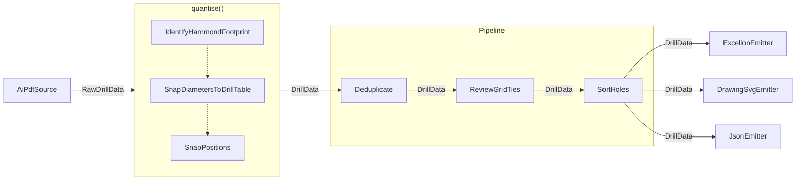

# ADR Rework Design

**Status:** Approved

## Purpose

Make the repository's ADRs living, definitive architectural documents. They must explain
the accepted design from domain constraints and first principles, while Git remains the
sole record of superseded designs and implementation history.

The rework also aligns adjacent documentation, source and test docstrings, catalogue
maintenance tooling, and tests with those decisions.

## Documentation authority

ADRs define architecture; implementation conforms to them. An architectural change must
update the relevant ADR before or with its implementation. Implementation history, test
results, source locations, and former identifiers are not evidence for an architectural
decision and do not belong in an ADR.

ADRs may name stable contract types and classes when those names are part of the design.
They must not cite source files, line numbers, tests, or Git history. Code and test
docstrings may refer to an ADR for deeper reasoning but must remain locally understandable.

Each ADR uses only the sections its decision needs, drawn from:

- **Context:** current domain constraints that require a decision.
- **Decision:** binding architectural rules.
- **Rationale:** first-principles reasoning connecting the constraints to the decision.
- **Consequences:** benefits, costs, and limitations that remain true.

Historical timelines, amendments, completed action lists, incident narratives, review
anecdotes, and speculative alternatives are excluded. An alternative is included only
when a plausible competing design must be ruled out to explain the chosen boundary.

## ADR structure

### ADR-0001: Processing architecture and artifact consistency

ADR-0001 defines the complete processing flow without mixing processors, aggregate
abstractions, and transferred values at one visual level. Its flow consists of a source
block, a quantisation block, the individual stage blocks grouped by a `Pipeline`
boundary, and emitter blocks. Data types label the connections rather than appearing as
nodes.

It establishes these rules:

- Sources report measurements without domain quantisation.
- Quantisation is the mandatory boundary that creates canonical `DrillData`.
- The pipeline is an ordered fold over independent `Stage` implementations.
- Facts shared by artifacts are computed once before emission.
- Emitters serialize and may perform presentation geometry, frame translation, and
  output-unit conversion; they do not re-derive model facts.
- Diagnostics and processing provenance are data carried by the model.
- Emitter registration is extensible, while CLI stage ordering remains an explicit
  integration point.

ADR-0001 includes at least one numbered Mermaid figure. Figure 1 uses individual
processing blocks as its nodes:

- `AiPdfSource` is the source block.
- Quantisation is one block for visual purposes; the block identifies `quantise()` and
  its three composed quantisers internally.
- `Deduplicate`, `ReviewGridTies`, and `SortHoles` are separate sequential blocks enclosed
  by a `Pipeline` subgraph.
- `ExcellonEmitter`, `DrawingSvgEmitter`, and `JsonEmitter` are the terminal processing
  blocks.

The connection from the source block to quantisation is labelled `RawDrillData`. Every
subsequent connection between processing blocks is labelled `DrillData`, including each
connection inside the `Pipeline` subgraph and each branch to a concrete emitter. Data
types never appear as peer nodes. Protocol conformance is shown as an annotation or
stereotype on the corresponding blocks, not as extra steps in the processing flow.

The figure follows this structure:

### ADR-0002: Domain answer sets and validation policy

ADR-0002 defines the authoritative answer set for each quantised quantity:

| Quantity | Authority |
|---|---|
| Hole position | Operator-declared grid |
| Hole diameter | Declared drill standard |
| Reference outline | Published enclosure footprint catalogue |

It derives the separation from domain authority: the operator may choose valid positions,
but tooling sizes and enclosure dimensions are externally constrained. It also defines:

- drill-standard selection and narrowing;
- rejection of unmatched diameters;
- withholding all artifacts when any error exists;
- enclosure matching, declaration semantics, and diagnostic severity;
- footprint identity as distinct from part identity;
- the backplate drawing convention and only its current arithmetic;
- `docs/parts/dimensions.tsv` as the checked-in catalogue authority;
- Hammond's website as the upstream source.

Ignored local manufacturer PDFs are maintenance inputs only. They are not distributed,
are not part of the architecture, and are not a test dependency. The deleted
`docs/1590.pdf` has no replacement inside the repository.

### ADR-0003: Quantisation boundary and ordering

ADR-0003 defines float millimetres as source measurements and integer nanometres as
canonical model values. It establishes one conversion boundary and forbids rounding a
measurement to nanometres before selecting an answer-set member.

The quantiser order is fixed by responsibility:

1. Enclosure identification runs first because it may invalidate the entire run.
2. Diameter quantisation runs second because it may reject individual holes.
3. Position quantisation runs last because it cannot reject a hole.

The ADR defines early termination, truthful processing provenance, and the distinction
between representation rounding and grid tie-breaking. A numbered Mermaid figure shows
normal completion, hole rejection, and enclosure-error termination.

The ADR also states a relevance gate: a numeric rule requires an observable artifact or
model invariant. A discrepancy confined to an artificial intermediate value is not an
architectural reason.

A future unit-newtype ADR is not created until that design is implemented.

## Diagrams

Mermaid diagrams are used when relationships or control flow are materially clearer than
prose. Figures are numbered within each ADR, captioned, and referenced in text as, for
example, “ADR-0001, Figure 1.” Stable contract identifiers are allowed; source paths and
line references are not.

## Adjacent repository changes

### Documentation

- Align `CLAUDE.md` with the three ADRs and the current type boundary.
- Rewrite `docs/parts/README.md` as a concise description of `dimensions.tsv`, upstream
  provenance, generation, and validation.
- Remove completed or stale catalogue and unit entries from `docs/BACKLOG.md`.
- Remove every stale SPEC citation and every reference to `docs/1590.pdf`.
- Preserve ignored `docs/parts/*.pdf` files without making them part of the repository
  contract.

### Catalogue maintenance

- Simplify `tools/build_catalogue.py` to generate from `docs/parts/dimensions.tsv` only.
- Remove the series-PDF parser and the `pdfplumber` development dependency.
- Regenerate `src/aidrill/enclosures.py` with an accurate concise header.
- Remove stale PDF-related configuration comments.

### Tests

- Retain exact comparison between the generated catalogue and `dimensions.tsv`.
- Remove series-PDF extraction and coarse-cross-check tests.
- Retain exact nanometre conversion, completeness, footprint grouping, and deterministic
  generation tests.
- Replace SPEC citations and shorten narrative test docstrings.

### Docstrings and architectural comments

Audit Python files under `src/`, `tests/`, and `tools/`. Remove former-state narratives,
bug chronology, review anecdotes, and implausible alternatives. Retain concise contracts,
domain constraints, ordering requirements, numeric invariants, and fixture properties.
ADRs own system-level reasoning; docstrings own local obligations.

Every module, class, function, and async-function docstring has a hard ceiling of 10
physical lines. One to five lines is the preferred range.

## Non-blocking docstring audit

Add a pytest test that parses Python files under `src/`, `tests/`, and `tools/` with
`ast`. It reports docstrings over 10 physical lines through one aggregated warning and
does not fail for length violations. Scanner failures, including unreadable or invalid
Python files, remain normal test failures.

## Verification

The implementation is complete when:

- the full pytest suite passes;
- Ruff and mypy pass;
- repository searches find no stale SPEC or `docs/1590.pdf` references;
- the docstring audit reports no remaining violations after the initial cleanup;
- Mermaid syntax is validated with an available local renderer, if one is installed;
- the three ADRs describe the implemented architecture without historical narrative or
  stale identifiers.

## Scope boundaries

This work does not change package runtime behavior. It removes development-only catalogue
maintenance paths that require the deleted PDF, while leaving quantisation, pipeline,
emitter, and catalogue behavior unchanged. Ignored manufacturer drawings remain untouched.
